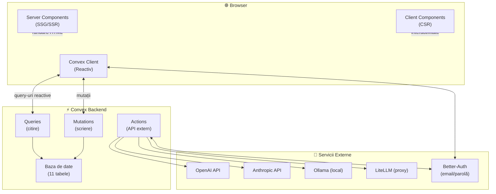
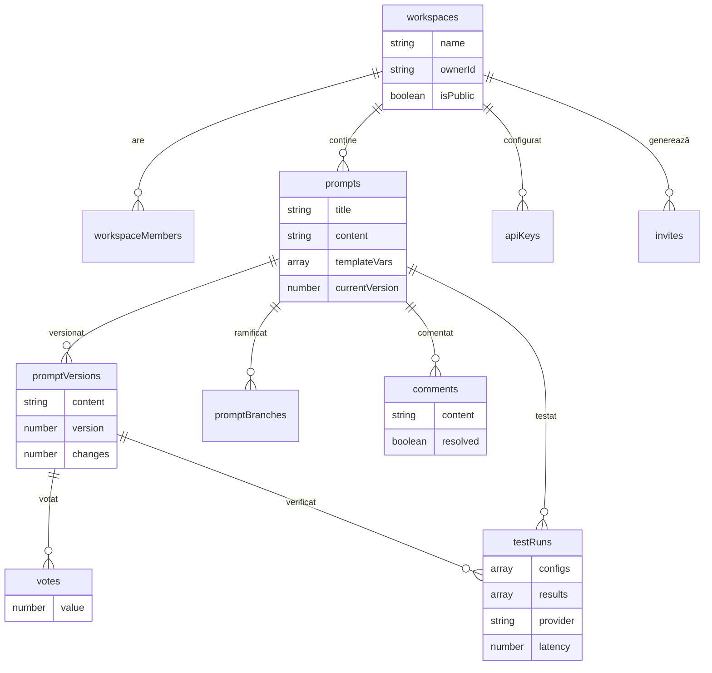
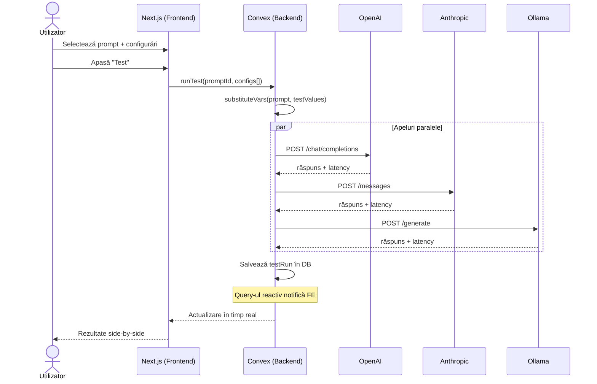

# Capitolul 3. Contribuția proprie

## 3.1. Introducere

Așa cum s-a demonstrat în capitolul anterior, piața instrumentelor de prompt engineering suferă de o fragmentare accentuată --- o realitate confirmată de analiza detaliată a celor patru platforme reprezentative. LMSYS Chatbot Arena [Chiang et al., 2024; Zheng et al., 2023] excelează la evaluarea modelelor prin mecanisme de crowdsourcing, însă nu oferă funcționalități de salvare, versionare sau optimizare iterativă a prompturilor. La polul opus, soluții enterprise precum PromptLayer asigură versionare și metrici de performanță, dar funcționează în ecosisteme complet închise, fără componentă comunitară. Niciuna dintre platformele analizate nu reușește să reunească, într-o singură interfață, managementul versionat al prompturilor, testarea multi-LLM, colaborarea în timp real și validarea prin vot crowdsourced.

Platforma Stratum Live, dezvoltată în cadrul acestei lucrări de licență, a fost concepută tocmai pentru a umple acest gol. Denumirea reflectă două concepte centrale: *strat* — fiecare iterație a unui prompt reprezintă un strat de rafinare, o treaptă în procesul de optimizare — și *live* — întregul flux de lucru se desfășoară în timp real, cu sincronizare instantanee între toți participanții conectați.

Prezentul capitol descrie contribuția practică a lucrării urmând paradigma științei proiectării sistemelor informaționale (Hevner et al., 2004): artefactul proiectat (platforma Stratum Live), relevanța problemei (fragmentarea instrumentelor de prompt engineering), evaluarea riguroasă a proiectării (testare automată și manuală) și contribuțiile aduse domeniului. Sunt detaliate arhitectura aplicației, tehnologiile alese și raționamentul din spatele fiecărei decizii, provocările tehnice reale întâmpinate în dezvoltare --- așa cum au fost ele documentate în jurnalul de proiect ---, strategiile de testare aplicate și, nu în ultimul rând, modul în care platforma depășește ceea ce se predă în cadrul cursurilor universitare din domeniul "Sisteme Informaționale". Capitolul se încheie cu o analiză a impactului economic estimat pentru trei categorii concrete de beneficiari.

## 3.2. Arhitectura generală a aplicației

Stratum Live este o aplicație web full-stack care funcționează pe un model arhitectural pe trei straturi. Backend-ul este externalizat aproape integral către platforma Convex, eliminând necesitatea administrării manuale a unui server, a configurării unor conexiuni WebSocket și a scrierii de endpoint-uri REST. În locul acestora, logica de business este scrisă exclusiv în TypeScript, sub forma unor funcții pur denumite *queries* (citire) și *mutations* (scriere), fiecare cu argumente validate prin scheme Zod.

Stratul de prezentare este construit cu **Next.js 16** și **React 19**, folosind App Router-ul pentru rutare. O trăsătură distinctă a arhitecturii este separarea permisivă la nivel de componentă, nu la nivel de pagină: componentele server, care livrează conținut indexabil de motoarele de căutare, coexistă în aceeași pagină cu componentele client (editorul de prompturi, panoul de parametri, sistemul de vot) care rulează în browser și gestionează starea interactivă local. Părțile statice se randează pe server și se hidratează pe client, iar cele dinamice rămân exclusiv pe client. Această flexibilitate reprezintă un avantaj arhitectural concret față de abordările clasice, unde compromisul între SEO și interactivitate se făcea la nivel global, nu granular.

Stratul de date este gestionat integral de Convex, o platformă backend-as-a-service care combină stocarea, logica de business și sincronizarea în timp real într-un singur sistem. Convex funcționează pe un model reactiv: atunci când o mutație modifică o înregistrare în baza de date, toate query-urile care depind de acea înregistrare sunt re-executate automat, iar rezultatele sunt împinse către clienții conectați --- fără nicio linie de cod scrisă pentru transportul datelor sau gestionarea canalelor de comunicare. Clientul declară ce date îl interesează, iar platforma se ocupă de notificare. Față de un setup clasic --- server REST separat, bază de date relațională, strat de caching și server WebSocket pentru timp real --- Convex reduce dramatic complexitatea de infrastructură. Dacă un utilizator votează un prompt, toți clienții care au acea resursă pe ecran primesc actualizarea instantaneu prin query-uri reactive, fără intervenție manuală.

Stratul de autentificare este gestionat de **Better-Auth**, o bibliotecă scrisă nativ pentru TypeScript, integrată cu Convex printr-un connector oficial. Better-Auth implementează autentificare pe bază de email și parolă, cu sesiuni gestionate server-side prin cookie-uri cu flag-urile HttpOnly și Secure. Această abordare elimină expunerea la atacuri de tip cross-site scripting (XSS), problemă documentată extensiv în literatura de securitate [Rodríguez et al., 2022]. Token-urile de sesiune nu sunt stocate niciodată în localStorage. Arhitectura de securitate respectă principiul Zero Trust și standardul OAuth 2.0 [Hardt, 2012].

Cele trei straturi comunică exclusiv prin intermediul Convex. Frontend-ul nu face apeluri HTTP directe către servere proprii, ci invocă funcții Convex printr-un client generat automat din definițiile de tip. Tipurile parametrilor și ale rezultatelor sunt validate atât la compilare, prin TypeScript, cât și la runtime, prin schemele Zod asociate fiecărei funcții. Dacă structura unui document se modifică în schemă, compilatorul semnalează instantaneu fiecare loc din cod unde acel document este folosit, prevenind o întreagă clasă de erori de runtime cauzate de date neașteptate.


*Figura 3.1: Arhitectura pe trei straturi a platformei Stratum Live — stratul de prezentare (Next.js 16 + React 19), stratul de date (Convex) și stratul de autentificare (Better-Auth)*


*Diagrama 3.1: Fluxul de date între straturile arhitecturale*

## 3.3. Stiva tehnologică și justificarea alegerilor

### 3.3.1. Next.js 16 și modelul de randare hibrid

Alegerea Next.js 16 ca framework principal a fost motivată de necesitatea arhitecturală de a combina trei modele de randare fundamental diferite, fiecare potrivit unui context specific al aplicației:

-   **Generare statică (SSG)** pentru pagina de prezentare și pentru paginile publice de prompturi --- conținut care trebuie să se încarce instantaneu și să fie indexabil impecabil de motoarele de căutare;
-   **Randare pe server cu streaming (SSR streaming)** pentru execuția testelor pe modelele de limbaj --- aici, răspunsul nu vine dintr-o dată ca un query SQL, ci se produce incremental, token cu token. Utilizatorul vede textul apărând progresiv, exact ca în interfețele ChatGPT sau Claude, fără să aștepte finalizarea completă a apelului API;
-   **Randare pe client (CSR)** pentru componentele colaborative --- editorul, chat-ul, sistemul de vot --- unde latența rețelei poate fi eliminată complet, interacțiunea rămânând strict locală.

Thakkar [2020] a demonstrat că arhitecturile SSR reduc semnificativ timpul până la primul element vizibil pe ecran (FCP) --- o metrică pe care Google a inclus-o oficial în algoritmii de clasare începând cu 2021. În cazul Stratum Live, modelul hibrid oferă tocmai această flexibilitate: posibilitatea de a alege strategia optimă de randare pentru fiecare pagină în parte, fără a forța un compromis global care ar dezavantaja fie SEO-ul, fie experiența interactivă.

### 3.3.2. Convex și arhitectura reactivă

Convex nu a fost ales doar ca simplă bază de date, ci ca platformă unificată de backend --- o decizie care a avut consecințe arhitecturale profunde asupra întregului proiect. În arhitecturile clasice, sincronizarea datelor între utilizatori multipli necesită o combinație de endpoint-uri REST, logică WebSocket pentru emiterea și ascultarea evenimentelor, actualizare manuală a stării locale și, inevitabil, cod duplicat între straturi. Convex elimină acest întreg strat de orchestrare.

Pentru a ilustra diferența: într-o arhitectură tradițională, adăugarea unui sistem de vot în timp real ar fi necesitat un endpoint POST pentru înregistrarea votului, o logică de broadcast prin WebSocket pentru notificarea celorlalți clienți și o actualizare manuală a stării UI pe fiecare client în parte. În Convex, aceeași funcționalitate se reduce la o mutație care scrie în baza de date --- iar query-urile reactive expun automat scorul actualizat către toți clienții. Actualizarea se propagă fără nicio linie de cod de infrastructură.

Alegerea are și un impact economic direct. Convex funcționează pe un model pay-per-use --- capacitatea de calcul scalează cu traficul real, fără costuri fixe pentru servere inactive --- iar efortul de dezvoltare se mută de la menținerea infrastructurii către logica de business. Pentru o platformă unde mai mulți utilizatori testează și evaluează simultan prompturi pe LLM-uri diferite, sincronizarea instantanee nu este o preferință, ci o condiție necesară.

### 3.3.3. TypeScript și validarea end-to-end a tipurilor

Kuznetsova și Cherkasov [2025] au demonstrat, pe un studiu controlat cu 60 de dezvoltatori, că TypeScript reduce densitatea de code-smell și complexitatea cognitivă a codului --- deși, trebuie menționat, necesită mai mult timp la implementarea inițială comparativ cu JavaScript-ul vanilla. În cadrul acestui proiect, TypeScript a fost folosit cu tipizare strictă pe întregul lanț: de la schemele bazei de date definite în Convex, trecând prin funcțiile backend (queries și mutations), până la componentele React care populează interfața.

Această coerență tipologică nu este doar un exercițiu academic --- are consecințe practice directe. Dacă structura unui document se modifică în schemă, compilatorul semnalează imediat fiecare loc din frontend și backend unde acel document este folosit cu o structură învechită. Erorile de runtime cauzate de date neașteptate --- o sursă frecventă de bug-uri în proiectele JavaScript --- sunt astfel prinse înainte ca aplicația să fie măcar pornită.

Pentru validarea la runtime --- acolo unde TypeScript-ul nu poate ajunge, fiind un sistem de tipuri la compilare --- s-au folosit două biblioteci complementare: Zod pentru validarea argumentelor funcțiilor Convex și a schemelor de autentificare, respectiv TanStack Form cu adaptor Zod pentru formularele din interfață.

### 3.3.4. Interfața utilizator: Tailwind CSS și Shadcn/UI

Construirea unui backend performant și sincronizat nu este suficientă dacă interfața devine imposibil de întreținut pe măsură ce aplicația crește în complexitate. Istoric, dezvoltarea web se baza pe fișiere CSS monolitice --- o abordare care genera inevitabil datorie tehnică vizuală, inconsistențe la scară și conflicte de stilizare de fiecare dată când mai mulți dezvoltatori lucrau pe același proiect.

Tailwind CSS 4 inversează această paradigmă prin modelul utility-first: în locul unor clase semantice abstracte definite în fișiere separate, stilurile se aplică direct pe elementele HTML prin clase utilitare predefinite --- `flex`, `p-4`, `text-lg` și așa mai departe. Rezultatul practic este un fișier CSS care conține exclusiv clasele folosite efectiv --- zero cod mort, zero conflicte de specificitate, zero efecte colaterale când o modificare vizuală într-un loc al aplicației afectează accidental un altul complet neînrudit.

Tailwind rezolvă problema stilizării, dar construirea de la zero a elementelor complexe de interfață --- dropdown-uri, modale, popover-e, panouri redimensionabile --- rămâne o sarcină care consumă timp și introduce riscuri de accesibilitate. Aici intervine Shadcn/UI, o colecție de componente headless construite peste primitivele Base UI (succesorul Radix UI). Componentele headless livrează doar logica de interacțiune și respectarea standardelor de accesibilitate, fără a impune un design vizual predefinit --- stilizarea rămâne exclusiv pe seama Tailwind-ului, permițând personalizarea completă a aspectului.

Editorul de prompturi --- componenta centrală a întregii platforme --- este construit pe **Monaco Editor**, aceeași componentă care stă la baza Visual Studio Code. Pentru a îmbunătăți experiența specifică de editare a prompturilor, a fost înregistrat un limbaj personalizat --- `prompt-template` --- care evidențiază sintactic variabilele de tip `{{variabila}}`, oferă autocompletare pentru variabilele comune și aplică o temă vizuală consistentă cu restul interfeței.

### 3.3.5. Testare automată

Testarea end-to-end a fost realizată cu **Playwright**. Gosik și Miłosz [2025] au comparat Playwright cu Cypress --- principalul său competitor în peisajul testării frontend --- și au demonstrat că Playwright consumă mai puțină memorie, execută testele mai rapid și, poate cel mai important, oferă suport nativ pentru mai multe browsere (Chromium, Firefox, WebKit) fără configurare suplimentară. În cadrul proiectului, Playwright a fost configurat să ruleze pe Chromium, cu capturi de ecran automate la eșec și mecanism de retry la prima eșuare. Configurația permite extinderea facilă la teste multi-browser, însă pentru faza de prototip testarea pe un singur motor de randare a fost considerată suficientă.

## 3.4. Modulele funcționale ale platformei

### 3.4.1. Spațiile de lucru și permisiunile

Aplicația se organizează în jurul conceptului de **spațiu de lucru** (*workspace*) --- un container logic care grupează prompturi, membri, configurări de API și rezultate ale testelor. Un spațiu de lucru poate fi public --- accesibil oricui are linkul, fără autentificare necesară pentru vizualizare --- sau privat --- accesibil exclusiv membrilor invitați de proprietar.

Modelul de permisiuni implementat are trei niveluri distincte: *owner* (proprietarul spațiului, care deține controlul complet --- poate șterge spațiul, gestiona membrii, modifica setările), *editor* (poate crea, modifica și șterge prompturi, poate rula teste) și *viewer* (poate vizualiza conținutul, istoricul și rezultatele testelor, dar nu poate face modificări). Această granularitate acoperă spectrul complet de scenarii de colaborare: de la echipe mici unde toți membrii editează activ, la organizații mari unde o parte din echipă doar supervizează rezultatele.

La nivelul bazei de date, permisiunile sunt implementate printr-un tabel `workspaceMembers` care leagă fiecare utilizator de spațiul de lucru printr-un rol explicit. Orice funcție backend --- query sau mutation --- care accesează resursele unui spațiu de lucru începe prin a verifica apartenența și rolul utilizatorului, utilizând o funcție helper centralizată (`getWorkspaceAccess`). Dacă utilizatorul nu este membru al unui spațiu privat, funcția întoarce imediat o eroare, blocând orice acces neautorizat la nivel de strat de date, nu doar la nivel de interfață.


*Diagrama 3.2: Schema bazei de date — entitățile principale și relațiile dintre ele*

### 3.4.2. Editorul colaborativ, versionarea și prezența în timp real

Editorul de prompturi este inima aplicației. Fiecare prompt are un istoric complet de versiuni, gestionat automat de platformă: la fiecare salvare, sistemul generează o nouă versiune cu număr incrementat, autor, marcaj temporal și o metrică a modificărilor --- numărul de linii schimbate față de versiunea precedentă. Acest istoric nu este doar un jurnal pasiv: utilizatorul poate oricând restaura o versiune anterioară, moment în care se creează o versiune nouă cu conținutul restaurat --- păstrând astfel lanțul complet al deciziilor.

Pentru colaborarea simultană, aplicația folosește **Yjs** (Y-CRDT), o bibliotecă de editare colaborativă bazată pe tipuri de date replicabile fără conflict (Conflict-free Replicated Data Types). Nicolaescu et al. [2015] au descris Yjs ca un framework capabil să gestioneze sincronizarea aproape în timp real între peer-i, pe tipuri de date arbitrare. În contextul Stratum Live, Yjs permite mai multor utilizatori să editeze simultan același prompt --- fiecare vede modificările celorlalți pe măsură ce acestea se produc, fără conflicte de editare. Algoritmul CRDT garantează că toate instanțele converg către o stare identică, indiferent de ordinea în care ajung modificările prin rețea.

Pe lângă editarea propriu-zisă, platforma expune și **indicatori de prezență în timp real**: lista utilizatorilor conectați la același prompt, poziția cursorului fiecărui participant în document și notificări de tip "utilizatorul tastează". Acești indicatori --- vizibili în bara de status a editorului --- transformă experiența de colaborare dintr-una asincronă, bazată pe refresh manual, într-una fluidă, similară cu Google Docs.

Sistemul de versionare include și conceptul de **branch**. Similar cu modul în care Git gestionează ramurile de cod, un utilizator poate crea un branch dintr-o versiune anterioară, poate lucra independent pe acesta și, când direcția este validată, poate face merge înapoi în ramura principală. Acest mecanism este deosebit de util pentru experimentarea prompturilor --- un scenariu frecvent în care ingineria prompturilor se aseamănă mai mult cu explorarea unui spațiu de soluții decât cu o succesiune liniară de îmbunătățiri.

Pentru portabilitate --- o necesitate practică ignorată de majoritatea platformelor concurente --- prompturile pot fi exportate în format **JSON** (include conținutul complet, variabilele template, istoricul versiunilor și metadatele asociate) sau **Markdown** (potrivit pentru documentație și partajare rapidă). Importul din JSON permite migrarea prompturilor între instanțe sau integrarea cu tooling extern.


*Figura 3.2: Interfața principală a editorului Stratum Live --- panoul de editare (stânga), panoul de parametri și testare (centru-dreapta) și panoul de versionare, comentarii și vot (dreapta)*

### 3.4.3. Testarea multi-provider

Modulul de testare este poate cel mai evident diferențiator între Stratum Live și instrumentele existente pe piață. Utilizatorul selectează una sau mai multe configurări --- fiecare constând dintr-un furnizor (OpenAI, Anthropic, Ollama sau LiteLLM ca proxy unificat), un model specific (gpt-4o, claude-sonnet-4-20250514, llama3 etc.), parametri de generare (temperature, max_tokens) și un set de valori pentru variabilele template --- și execută promptul simultan pe toate modelele configurate. Rezultatele --- răspunsul textual și latența măsurată --- sunt afișate una lângă alta, permițând compararea vizuală directă.

Arhitectura de testare urmează modelul **BYOK** (Bring Your Own Key): utilizatorii își introduc propriile chei API, iar platforma nu impune niciun furnizor prestabilit și nu taxează pentru apeluri. Cheile sunt stocate în baza de date Convex codificate în base64 --- o măsură de securitate modestă, suficientă pentru un prototip funcțional, dar care ar necesita, într-o versiune de producție, criptare simetrică cu o cheie gestionată separat, în afara bazei de date. Furnizorii suportați acoperă spectrul complet de la API-uri cloud comerciale (OpenAI, Anthropic) la modele auto-găzduite (Ollama) și proxy-uri unificate (LiteLLM).

Apelul efectiv către API-urile externe este realizat printr-o mutație Convex. Pentru fiecare furnizor, mutația construiește cererea în formatul nativ al API-ului respectiv --- endpoint-ul `/chat/completions` pentru OpenAI și LiteLLM, `/messages` pentru Anthropic, `/generate` pentru Ollama --- și returnează răspunsul împreună cu latența măsurată în milisecunde. În faza de dezvoltare, testele au fost rulate împotriva unui server mock local --- `mock-llm-server.js` --- care simulează răspunsuri realiste cu latență variabilă, permițând testarea funcționalității fără consum de credit API.


*Diagrama 3.3: Fluxul de testare multi-provider — de la acțiunea utilizatorului până la afișarea rezultatelor*

### 3.4.4. Sistemul de vot și evaluare

Sistemul de vot este conceput ca un mecanism de validare distribuită a calității prompturilor. Utilizatorii pot vota pozitiv sau negativ fiecare versiune de prompt --- dar, spre deosebire de platformele de tip forum unde votul se bazează pe impresii subiective, Stratum Live impune o regulă esențială: **un vot poate fi exprimat doar pentru versiunile care au fost testate cel puțin o dată**. Aceasta ancorează evaluarea în date obiective --- utilizatorul vede răspunsul concret al modelului înainte de a judeca promptul care l-a generat.

Logica de vot funcționează în mod toggle: același vot repetat se retrage, iar un vot din direcția opusă îl înlocuiește pe cel anterior. Scorul net al unei versiuni --- diferența dintre voturile pozitive și cele negative --- este expus prin query-uri reactive: orice vot nou modifică instantaneu scorul vizibil în interfață pentru toți utilizatorii conectați la acel prompt. Fiecare vot notifică automat autorul promptului, creând un circuit de feedback imediat.

### 3.4.5. Comentarii și notificări

Sistemul de comentarii operează pe două planuri distincte, ambele stocate în același tabel `comments` dar diferențiate funcțional. Pe de o parte, comentariile asociate unei versiuni specifice de prompt --- cu posibilitatea de a marca un interval de text prin `selectionStart` și `selectionEnd` --- funcționează ca un code review pentru prompturi. Pe de altă parte, mesajele de chat asociate promptului în ansamblu (fără `versionId` și `selectionRange`) oferă un canal de comunicare liberă între colaboratori.

Sistemul de notificări acoperă patru tipuri de evenimente: comentarii noi la prompturile proprii, mențiuni directe prin `@utilizator`, voturi primite și invitații la spații de lucru. Notificările sunt generate de funcțiile backend imediat după executarea mutației care a declanșat evenimentul --- de exemplu, mutația `voteVersion` apelează automat funcția `notifyVote` după înregistrarea votului. Un mecanism simplu, dar eficient, previne auto-notificarea: utilizatorul care execută acțiunea nu primește notificare pentru propria acțiune.

## 3.5. Provocări tehnice și soluțiile aplicate

Dezvoltarea aplicației nu a fost un proces linear. Această secțiune documentează cele mai semnificative probleme tehnice întâmpinate --- așa cum au fost ele consemnate în jurnalul de dezvoltare al proiectului --- și soluțiile prin care au fost depășite.

### 3.5.1. Parametrii dinamici în Next.js 16

Primul obstacol major a survenit la implementarea paginii de workspace --- o rută dinamică (`/workspace/[id]/page.tsx`) care, în versiunile anterioare de Next.js, primea parametrul `id` sub forma unui obiect simplu. În Next.js 16, același parametru este livrat sub forma unui `Promise` care trebuie dezasamblat explicit cu hook-ul `use()` din React. Tentativa de a accesa `params.id` direct --- perfect validă în Next.js 14 și 15 --- producea o eroare de runtime cu un mesaj surprinzător pentru un dezvoltator obișnuit cu versiunile anterioare.

Cauza nu era un bug, ci o schimbare arhitecturală profundă: React 19 a introdus suportul pentru componente asincrone, iar Next.js 16 a aliniat mecanismul de parametri dinamici la acest model. Soluția a constat în două modificări punctuale: importul hook-ului `use` din React și tipizarea explicită a parametrilor ca `Promise<{ id: string }>` urmată de dezasamblare prin `const { id } = use(params)`. Deși eroarea în sine era trivială ca rezolvare, ea a fost prima dintr-o serie de lecții despre importanța consultării ghidurilor de migrare atunci când se adoptă o versiune majoră nouă a unui framework.

```
// Listarea 3.1: Accesarea parametrilor dinamici în Next.js 16
import { use } from "react";

export default function WorkspacePage({
  params,
}: {
  params: Promise<{ id: string }>;
}) {
  const { id } = use(params); // params este Promise, nu obiect
  // ...
}
```

### 3.5.2. Modelul de execuție Convex

A doua problemă semnificativă a apărut în implementarea sistemului de testare. Pentru a simula un comportament realist în faza de prototip, codul original introducea o latență artificială prin `setTimeout` --- o practică perfect funcțională într-un mediu Node.js standard, dar imposibilă în contextul Convex. Platforma interzice explicit utilizarea `setTimeout` (precum și a altor primitive asincrone) în *queries* și *mutations*, deoarece aceste funcții trebuie să fie strict deterministe pentru a fi cache-uite și re-executate fiabil.

Soluția a fost, pe de o parte, eliminarea întârzierii artificiale --- apelurile reale către API-urile LLM au oricum latența lor naturală, ceea ce face ca o simulare să fie redundantă ---, iar pe de altă parte, o restructurare conceptuală a codului pentru a separa clar operațiile pure (care rămân în mutations) de cele cu efecte secundare (care trebuie mutate în *actions* --- funcții Convex special concepute pentru apeluri de rețea și operații ne-deterministe). Această experiență a scos în evidență o diferență fundamentală între un backend tradițional --- unde orice fragment de cod Node.js este permis, fără restricții --- și o platformă reactivă precum Convex, unde constrângerile de execuție sunt impuse tocmai pentru a garanta consistența datelor și predictibilitatea comportamentului.

```
// Listarea 3.2: Apelul API extern prin Convex action (nu mutation)
// Mutations nu permit setTimeout; operațiile async se mută în actions
export const runTest = action({
  args: { promptId: v.id("prompts"), keyId: v.id("apiKeys"), /* ... */ },
  handler: async (ctx, args) => {
    const apiKey = await ctx.runQuery(api.apiKeys.getApiKey, { keyId: args.keyId });
    const prompt = await ctx.runQuery(api.prompts.getPrompt, { promptId: args.promptId });
    const response = await callLLM(apiKey.provider, apiKey.secret, apiKey.model, prompt.content);
    await ctx.runMutation(api.testRuns.saveResult, { /* ... */ });
  },
});
```

### 3.5.3. Integrarea Better-Auth cu Convex

Configurarea autentificării a fost un proces iterativ, nu o integrare din prima încercare. Versiunea 1.6.x a Better-Auth nu era compatibilă cu connectorul oficial `@convex-dev/better-auth` la momentul dezvoltării --- un conflict de versiuni care a forțat fixarea explicită a Better-Auth la versiunea 1.5.3. Mai mult, configurația completă prezentată în documentația oficială presupunea fișiere suplimentare pentru rutarea HTTP și gestionarea emailurilor --- componente care, pentru un prototip funcțional, au fost considerate premature. S-a optat pentru o configurare minimală, cu înregistrarea strictă a componentelor de autentificare necesare.

În timpul rulării, au apărut erori intermitente de autentificare: query-urile protejate returnau, aparent aleatoriu, mesajul "Not authenticated". Investigația a relevat o cauză neașteptată --- nu logica de autentificare în sine era defectuoasă, ci token-ul de dezvoltare Convex expira fără a fi reînnoit, blocând validarea sesiunilor. Soluția operațională a constat în reluarea comenzii `npx convex dev` --- care reîmprospătează token-ul de dezvoltare --- și în adăugarea unei pagini de debug (`/debug-settings`) dedicată vizualizării stării curente de autentificare, instrument care s-a dovedit valoros pe tot parcursul dezvoltării.

### 3.5.4. Hidratarea claselor CSS în Tailwind 4

O provocare care a rămas parțial nerezolvată --- și care merită menționată tocmai pentru că ilustrează o interacțiune subtilă între framework-uri --- a fost apariția unor erori de hidratare cauzate de clase CSS injectate dinamic de Tailwind CSS 4 în modul de dezvoltare. Pe client, elementul `<html>` apărea cu clase suplimentare (`idc0_343`, `oqknntdc`) care nu existau pe server --- diferență care declanșa avertismentul de hidratare al React.

Cauza: în modul de dezvoltare, Tailwind CSS 4 generează clase de urmărire a utilizării --- un mecanism de optimizare care elimină clasele nefolosite din bundle-ul final. Aceste clase sunt produse diferit la compilare (pe server) și la runtime (în browser). În producție, fenomenul dispare complet, deoarece clasele sunt pre-compilate și nu mai există generare dinamică. S-a decis acceptarea acestor avertismente în faza de dezvoltare, cu observația că nu afectează nici funcționalitatea, nici experiența utilizatorului.

## 3.6. Strategia de testare

Testarea aplicației a urmat o abordare pe trei paliere complementare:

1.  **Validare automată la compilare** prin TypeScript (tipizare strictă, `strict: true`) și ESLint cu regulile `eslint-config-next` --- prima linie de apărare împotriva erorilor de tip, a variabilelor neutilizate și a problemelor de stil care, netratate, se acumulează în datorie tehnică;
2.  **Testare manuală iterativă** pe parcursul dezvoltării --- fiecare modul nou (autentificare, workspace-uri, editor, testare LLM, vot) a fost testat funcțional în izolare înainte de integrarea cu restul aplicației;
3.  **Testare end-to-end automatizată** cu Playwright --- 8 scenarii care acoperă fluxul principal de utilizare și elementele esențiale de interfață.

Suita E2E este organizată în două grupuri. Primul verifică paginile principale și fluxul de autentificare: landing page-ul este accesibil și conține titlul și linkurile de navigare corecte, pagina `/auth` afișează ambele formulare (login și signup) cu câmpurile așteptate, iar elementele de brand (logo, mesajul BYOK) sunt prezente în header și footer. Al doilea grup verifică elemente de interfață secundare, confirmând coerența vizuală a aplicației.

Testele rulează pe Chromium, cu un singur worker --- o configurare conservatoare, potrivită pentru un proiect de licență, care prioritizează stabilitatea în detrimentul paralelismului. Capturile de ecran sunt generate automat doar la eșec, iar mecanismul de retry (o singură reîncercare) recuperează eșecurile cauzate de fluctuații de rețea. Timpul total de execuție al suitei complete se situează sub 2 minute, ceea ce o face compatibilă cu integrarea într-un pipeline CI/CD minimal.

## 3.7. Ce aduce în plus față de curricula universitară

Dezvoltarea Stratum Live a presupus stăpânirea unor concepte și tehnologii a căror complexitate depășește vizibil programa cursurilor standard din domeniul "Sisteme Informaționale".

**Meta-framework-uri full-stack.** Disciplinele de programare web din planul de învățământ abordează cu precădere arhitecturi cu separare strictă: frontend (HTML, CSS, JavaScript) și backend (PHP sau Java), comunicând prin cereri HTTP. Stratum Live este construit pe Next.js 16 --- un meta-framework care dizolvă această graniță. React Server Components, streaming-ul prin Suspense boundaries, modelul de randare hibrid configurabil la nivel de componentă --- acestea sunt concepte care aparțin frontierei actuale a dezvoltării web, nu programei de licență.

**Backend-as-a-Service și programare reactivă.** Convex inversează fundamental modelul predat în cursuri. În loc de a configura un server, a scrie endpoint-uri REST și a gestiona conexiuni WebSocket, dezvoltatorul scrie exclusiv funcții TypeScript --- queries și mutations --- iar platforma se ocupă de execuție, securitate, sincronizare și scalare. Sincronizarea în timp real nu mai este o funcționalitate adăugată post-factum printr-un strat separat, ci o proprietate nativă a sistemului.

**Tipizare end-to-end cu validare la runtime.** Proiectul demonstrează practic cum TypeScript, combinat cu scheme Zod și validări Convex, poate garanta consistența tipurilor pe întregul lanț --- de la structura tabelelor până la input-urile din formularele UI. Aceasta nu este o simplă utilizare a TypeScript-ului ca "JavaScript cu adnotări", ci o arhitectură tipologică integrată, un subiect care nu este acoperit în cursurile introductive de programare.

**Colaborare în timp real cu CRDT.** Implementarea editării simultane prin Yjs, cu algoritmi de rezolvare automată a conflictelor, sincronizare de cursor și indicatori de prezență, este un subiect de inginerie software avansată --- predat, de regulă, la nivel de master sau doctorat, nu în cadrul programelor de licență în informatică economică.

**Testare automată end-to-end.** Deși conceptul de testare software este menționat în cadrul cursurilor, implementarea practică a unei suite E2E cu Playwright --- incluzând gestionarea stării de autentificare, fixture-le pentru date de test și configurarea multi-browser --- reprezintă competențe care se formează în practica industrială, nu în laboratoarele didactice.

## 3.8. Beneficiari și impact economic

Dincolo de valoarea sa tehnică, platforma Stratum Live are potențialul de a genera beneficii economice concrete pentru cel puțin trei categorii distincte de utilizatori.

### 3.8.1. Companii de dezvoltare software care integrează LLM-uri

Companii precum **UiPath** --- multinațională românească fondată la București, cu peste 4.000 de angajați și o capitalizare bursieră de peste 10 miliarde USD --- dezvoltă produse de automatizare care integrează masiv modele lingvistice. Într-o astfel de organizație, echipe de ingineri de prompt creează și optimizează sute de instrucțiuni lunar. Fără o platformă centralizată, cunoștințele se fragmentează în documente personale, canale Slack și fișiere de configurare locale --- o risipă de resursă intelectuală pe care Stratum Live o poate stopa.

O echipă de 10 ingineri care adoptă platforma ar putea:
-   Reduce timpul mediu de iterație al unui prompt de la 30 de minute la aproximativ 10 minute --- testarea simultană pe mai multe modele elimină necesitatea de a rula același prompt secvențial pe fiecare furnizor în parte;
-   Elimina duplicarea efortului: un prompt optimizat pentru un caz de utilizare specific, odată salvat în biblioteca partajată a spațiului de lucru, nu mai trebuie redescoperit de la zero de fiecare coleg;
-   Reduce consumul de tokeni cu 20-30% prin eliminarea variantelor sub-optimale --- prompturile validate prin vot și review colegial tind să fie mai concise și mai precise, ceea ce se traduce direct în costuri API mai mici.

La o scară de sute de mii de apeluri API lunar --- un volum realist pentru o echipă enterprise --- o reducere de 25% a tokenilor consumați poate însemna economii directe de 5.000-15.000 USD pe lună.

### 3.8.2. Instituții academice și centre de cercetare

Facultăți precum **Universitatea "Alexandru Ioan Cuza" din Iași** sau **Universitatea Politehnica din București** --- ambele cu programe active de cercetare în inteligență artificială --- pot utiliza Stratum Live în două moduri complementare. Pe de o parte, ca instrument didactic: în cadrul laboratoarelor de AI sau inginerie software, studenții pot experimenta cu prompt engineering într-un mediu colaborativ, comparând rezultatele aceluiași prompt pe modele diferite și rafinându-și instrucțiunile pe baza feedback-ului de la colegi și profesori.

Pe de altă parte, platforma poate servi ca infrastructură de cercetare. Datele agregate --- versiuni, scoruri, voturi, latențe, rezultate --- constituie un set valoros pentru studii empirice asupra eficienței diferitelor tehnici de prompting. Cercetătorii pot corela structura unui prompt (lungime, prezența variabilelor template, formularea) cu performanța acestuia pe diverse modele, generând cunoștințe transferabile dincolo de cazurile individuale.

### 3.8.3. Dezvoltatori independenți și micro-startup-uri

Profesioniștii independenți --- consultanți AI, freelanceri care integrează LLM-uri în produsele clienților, fondatori de startup-uri în fază incipientă --- reprezintă probabil categoria care resimte cel mai acut lipsa unor instrumente accesibile de prompt engineering. Pentru un dezvoltator independent, fiecare oră petrecută iterând manual prompturi este o oră nefacturată, iar fiecare token irosit pe o variantă sub-optimală este un cost direct dintr-un buget adesea restrâns.

Un scenariu tipic: un consultant AI petrece 10 ore pe săptămână testând și optimizând prompturi pentru clienți. Cu Stratum Live, testarea simultană pe mai multe modele și biblioteca de prompturi validate pot reduce acest timp la 4-5 ore. La un tarif orar de 50-100 USD, economia săptămânală se situează între 250 și 500 USD --- adică 13.000-26.000 USD pe an, o sumă deloc neglijabilă pentru o afacere individuală. Mai mult, accesul la o colecție de prompturi validate de comunitate reduce semnificativ timpul de pornire pentru proiecte noi --- în loc să înceapă de la zero cu fiecare client, dezvoltatorul pornește de la un fundament deja testat.

### 3.8.4. Beneficii comune

Dincolo de specificul fiecărei categorii, platforma aduce trei îmbunătățiri transversale, valabile pentru orice tip de utilizator:

-   **Reducerea timpului de iterație.** Testarea simultană pe N modele reduce timpul total de testare proporțional cu N, eliminând necesitatea de a rula același prompt secvențial.
-   **Creșterea calității prin evaluare distribuită.** Voturile și comentariile creează un mecanism de peer-review continuu --- feedback imposibil de obținut într-un flux de lucru individual, izolat.
-   **Conservarea cunoștințelor.** Istoricul complet de versiuni, contextul fiecărei decizii și rezultatele testelor transformă prompturile din artefacte efemere, personale, în active organizaționale durabile.

## 3.9. Sinteză

Platforma Stratum Live constituie un artefact informațional concret --- o instanțiere a paradigmei științei proiectării, sub forma unei aplicații web funcționale care adresează o lacună reală din ecosistemul instrumentelor de prompt engineering. În termenii definiți de Hevner et al. (2004), artefactul îmbină constructori (vocabularul specific de prompt engineering: variabile template, versiuni, branch-uri, voturi), modele (schema bazei de date cu 11 tabele, arhitectura pe trei straturi) și metode (procesul de testare multi-LLM, workflow-ul de versionare, sistemul de vot).

Evaluarea riguroasă a artefactului a fost realizată pe trei paliere: validare automată la compilare (TypeScript, ESLint), testare manuală iterativă a fiecărui modul și testare end-to-end automatizată cu Playwright. Rezultatele testelor au confirmat funcționarea corectă a fluxului principal de utilizare și coerența interfeței.

Din perspectivă tehnică, proiectul a demonstrat viabilitatea practică a arhitecturilor hibride bazate pe Next.js și Convex pentru aplicații colaborative complexe. Externalizarea backend-ului către o platformă reactivă a eliminat un întreg strat de cod de infrastructură --- endpoint-uri REST, servere WebSocket, logică de sincronizare --- permițând concentrarea efortului de dezvoltare pe funcționalitățile care diferențiază produsul. Provocările întâmpinate --- de la schimbările de paradigmă din Next.js 16 la constrângerile modelului de execuție Convex --- au oferit lecții valoroase despre maturitatea ecosistemelor tehnologice moderne.

Contribuția principală a acestei lucrări constă în demonstrația practică a faptului că ingineria prompturilor poate fi transformată dintr-o activitate individuală și empirică într-un proces colaborativ, măsurabil și scalabil. Platforma combină patru piloni care, în peisajul tehnologic actual, nu se regăsesc împreună în nicio altă soluție: managementul versionat al prompturilor, testarea simultană pe LLM-uri multiple, colaborarea în timp real cu prezență și sincronizare de cursor, și validarea calității prin vot distribuit. Cele trei categorii de beneficiari identificați --- companii software precum UiPath, instituții academice și dezvoltatori independenți --- pot extrage din platformă avantaje economice cuantificabile, de la reducerea costurilor operaționale cu token-ii API la conservarea cunoștințelor organizaționale.

*Această secțiune va fi reluată și extinsă în Capitolul 4 --- Concluzii, unde vor fi prezentate argumentația atingerii scopului lucrării, sinteza contribuțiilor proprii și perspectivele de continuare a cercetării.*

---

## Referințe

Hevner, A. R., March, S. T., Park, J., & Ram, S. (2004). Design science in information systems research. *MIS Quarterly*, 28(1), 75-105. https://doi.org/10.2307/25148625

Chiang, W.-L., Zheng, L., Sheng, Y., Angelopoulos, A. N., Li, T., Li, D., Zhang, H., Zhu, B., Jordan, M., Gonzalez, J. E., & Stoica, I. (2024). Chatbot Arena: An open platform for evaluating LLMs by human preference. *Proceedings of the 41st International Conference on Machine Learning*, 235, 8356-8374. https://doi.org/10.48550/arXiv.2403.04132

Ekin, S. (2023). Prompt engineering for ChatGPT: A quick guide to techniques, tips, and best practices. *TechRxiv*. https://doi.org/10.36227/techrxiv.22683919.v2

Gosik, P., & Miłosz, M. (2025). Comparative analysis of Cypress and Playwright frameworks in end-to-end testing for applications based on Angular. *Journal of Computer Sciences Institute*, 34, 55-62. https://doi.org/10.35784/jcsi.7662

Hardt, D. (Ed.). (2012). The OAuth 2.0 authorization framework (RFC 6749). *Internet Engineering Task Force*. https://doi.org/10.17487/rfc6749

Kuznetsova, Y., & Cherkasov, D. (2025). Empirical study of the impact of TypeScript on code quality and development productivity of web applications. *European Open Science Space*. https://doi.org/10.70286/eoss-01.12.2025.009

McKinsey Global Institute. (2023). *The economic potential of generative AI: The next productivity frontier*. McKinsey & Company. https://www.mckinsey.com/capabilities/mckinsey-digital/our-insights/the-economic-potential-of-generative-ai-the-next-productivity-frontier

Nicolaescu, P., Jahns, K., Derntl, M., & Klamma, R. (2015). Yjs: A framework for near real-time P2P shared editing on arbitrary data types. *Lecture Notes in Computer Science*, 9466, 219-232. https://doi.org/10.1007/978-3-319-19890-3_55

Rodríguez, G. E., Torres, J. G., & Benavides-Astudillo, E. (2022). DataCookie: Sorting cookies using data mining for prevention of cross-site scripting (XSS). *Emerging Trends in Cybersecurity Applications*, 155-172. https://doi.org/10.1007/978-3-031-09640-2_8

Thakkar, M. (2020). *Building React apps with server-side rendering*. Apress. https://doi.org/10.1007/978-1-4842-5869-9

Zheng, L., Chiang, W.-L., Sheng, Y., Zhuang, S., Wu, Z., Zhuang, Y., Lin, Z., Li, Z., Li, D., Xing, E. P., Zhang, H., Gonzalez, J. E., & Stoica, I. (2023). Judging LLM-as-a-judge with MT-Bench and chatbot arena. *Advances in Neural Information Processing Systems*, 36, 46595-46623. https://doi.org/10.48550/arXiv.2306.05685
