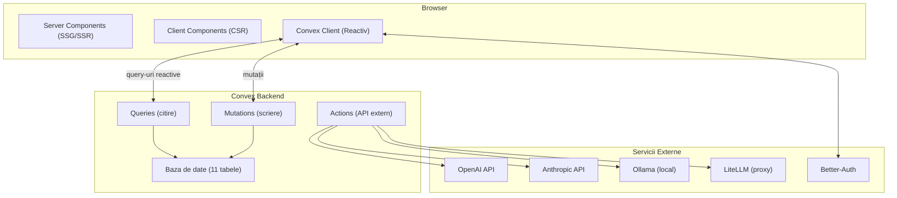
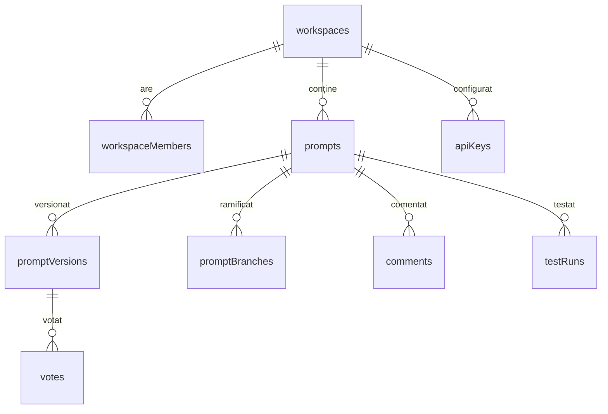
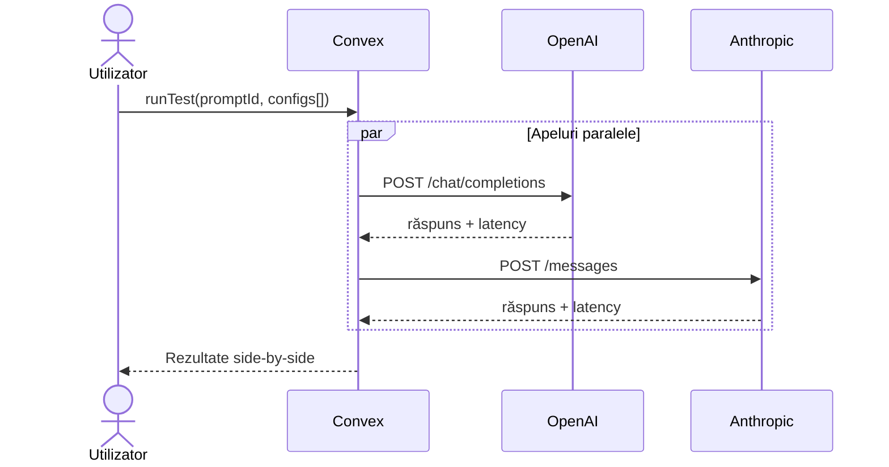

<!-- PANDOC-CITATIONS: Folosește --citeproc --bibliography=references_full.bib --csl=apa.csl -->

# INTRODUCERE

Inteligența artificială generativă are un potențial de adăugare anuală de 2,6 până la 4,4 trilioane de dolari la economia globală, conform raportului McKinsey Global Institute din 2023, sumă comparabilă cu PIB-ul Marii Britanii din 2021. În acest context, un singur element decide dacă un model de limbaj mare (LLM) produce valoare autentică sau doar risipă de resurse: promptul.

Promptul reprezintă noua formă de programare a erei inteligenței artificiale. Nu se mai programează mașinile prin cod rigid, ci prin limbaj natural care le ghidează să producă rezultate la scară largă. Totuși, în anul 2025-2026, ingineria prompturilor rămâne în mare parte o activitate individuală, empirică și ineficientă. Un inginer testează zeci de variante manual, compară rezultatele în mod subiectiv, iar cunoștințele acumulate se risipesc în chat-uri Slack, documente Google sau notițe personale. Platformele care să transforme această practică artizanală într-un proces colaborativ, măsurabil și scalabil la nivel de comunitate lipsesc aproape complet.

Prezenta lucrare de licență propune o soluție concretă la această problemă: dezvoltarea unei platforme web colaborative de prompt engineering. Platforma permite utilizatorilor, de la dezvoltatori independenți până la echipe enterprise, să realizeze următoarele operațiuni:

- testarea prompturilor în timp real pe multiple modele de limbaj mari (OpenAI, Anthropic, Google, modele open-source);
- votarea prompturilor și a variantelor acestora într-un sistem de tip „arenă" comunitar, inspirat de LMSYS Chatbot Arena, dar orientat exclusiv spre calitatea prompturilor;
- rularea de teste batch automate pe seturi de prompturi, seturi de date și parametri de generare, însoțite de metrici obiective de evaluare;
- colaborarea în timp real, cu sincronizare instantanee a modificărilor și istoric complet al versiunilor;
- partajarea bibliotecilor publice sau private de prompturi optimizate, cu etichetare semantică și recomandări bazate pe performanță.

Aplicația transformă ingineria prompturilor dintr-o activitate solitară și subiectivă într-un proces comunitar, în care varianta optimă de prompt nu mai depinde exclusiv de intuiția individuală, ci de validarea colectivă prin voturi și date.

Realizarea platformei a demonstrat cum arhitecturile web moderne (hibride SSR/SSG combinate cu componente reactive) pot accelera inovația în domeniul inteligenței artificiale. A fost utilizat stack-ul Next.js 15 (App Router, React Server Components, Streaming), TypeScript cu tipizare strictă, Tailwind CSS și Shadcn/UI pentru interfață și, central, baza de date reactivă Convex care asigură sincronizarea în timp real fără gestionarea manuală a conexiunilor WebSocket.

O îmbunătățire de 10-20% a calității prompturilor se traduce în reduceri ale costurilor cu tokenii și diminuarea iterațiilor umane. Echipele care adoptă procese structurate de prompt engineering pot înregistra creșteri de productivitate cuprinse între 20% și 50%. Aplicația oferă startup-urilor mici și profesioniștilor independenți acces la instrumente care până recent erau rezervate marilor corporații.

# CAPITOLUL 1. ANALIZA CONTEXTULUI TEHNOLOGIC ȘI ECONOMIC AL APLICAȚIILOR WEB MODERNE

World Wide Web-ul a evoluat de la pagini web statice la sistemele foarte inteligente și colaborative disponibile pe piața actuală. Dovezile empirice confirmă relația dintre performanța aplicațiilor informatice și profitabilitatea afacerilor: viteza mai mare a aplicațiilor a devenit un predictor al generării de venituri. Inteligența artificială generativă redefinește arhitecturile software și accelerează productivitatea la nivel global.

## 1.1. Dinamica evolutivă a World Wide Web

Evoluția sistemelor informatice bazate pe web din ultimele trei decenii urmează o traiectorie de complexitate crescătoare. Analiza cronologică arată o tranziție de la tehnologiile statice, destinate prezentării informațiilor, la ecosisteme inteligente masive de surse și rezervoare de informații care interacționează. Evoluția etapizată aduce la iveală atât exemple de aplicații de succes, cât și apariția unor modele de afaceri eficiente care accelerează progresul tehnologiei. Tranziția poate fi împărțită în patru epoci succesive, fiecare cu o redefinire a operațiunilor utilizatorului și a puterii aplicațiilor.

- **WEB 1.0 | Web static (aprox. 1990–2004)**

Această primă fază, denumită „Document Based Web" (Web bazat pe documente), s-a bazat pe un model simplu de comunicare unidirecțională. Site-urile aveau sarcina de a afișa informații despre companii, îndeplinind funcția unui portal de informații sau a unei „broșuri digitale".

Dintr-o perspectivă economică, principala valoare adăugată a acestei faze a fost reducerea costurilor de distribuție a informațiilor și amplificarea vizibilității mărcii la nivel mondial, fără costuri logistice, la scară globală. Simultan, piața era cuprinsă de speculații despre potențialul digitalizării. Companiile care dominau acea epocă, Yahoo! în cel mai evident caz, au atins valori record de piață (peste 128 de miliarde de dolari americani [@Hall2000]), consacrând internetul ca noul mediu global de furnizare a informațiilor.

Totuși, puterea utilizatorului era limitată, permițând doar consumul pasiv de informații de pe site-urile preluate în liste atent selectate, dintre care DMOZ era liderul. Comunicarea bidirecțională dintre utilizator și companie era practic inexistentă, iar tehnologia principală era HTML.

- **WEB 2.0 | Web-ul social (aprox. 2004–2010)**

Odată cu apariția WEB 2.0, de la un web cu puțină interacțiune la ceea ce se numește „Web centrat pe oameni" cu concepte precum filtrarea colaborativă și spațiul de lucru virtual distribuit, comunicarea a devenit o stradă cu două sensuri, iar utilizatorul din spectator s-a transformat într-un creator de conținut. Comunitățile online au crescut ca număr și s-au concentrat pe modelul „scriere-citire" și pe platformele de socializare.

Perspectiva economică arată că modelul de afaceri s-a schimbat: s-a mutat de la vânzarea de produse la vânzarea de date, trafic și informații despre potențialii clienți. Principalul creator de valoare s-a dovedit a fi „efectul de rețea", un model care a adus companii precum Facebook la o capitalizare de piață de peste 1 trilion de dolari [@Feiner2021], la fel ca și Alphabet [@Novet2020].

- **WEB 3.0 | Web-ul semantic (aprox. 2010–2020)**

Explozia rețelelor sociale a generat cantități uriașe de date și a accelerat tranziția către un web „semantic". S-a trecut de la simpla stocare a informațiilor la organizarea acestora într-un format inteligibil pentru motoarele de căutare. Internetul este omniprezent și integrat în viața cotidiană prin dispozitivul mobil, iar modul de interacțiune evoluează către un model „scrie-citește-rulează". Aplicațiile încep să interpreteze contextul utilizatorilor și să ia decizii în numele acestora.

Din punct de vedere economic, WEB 3.0 a consolidat modelul de afaceri SaaS (Software as a Service) și a accelerat economia bazată pe abonament. Organizațiile au început externalizarea la scară largă a infrastructurii Cloud, segmentul SaaS devenind cel mai mare segment al pieței de servicii cloud publice [@Gartner2019]. Astfel, acestea au favorizat agilitatea și inventivitatea pentru a lansa pe piață produse noi profitabile. Giganții au adoptat metoda de fidelizare a clienților printr-un sistem sofisticat de recomandări făcute prin intermediul tehnologiilor Big Data.

- **WEB 4.0 | Web-ul inteligent (aprox. 2020–prezent)**

Spre deosebire de WEB 1.0, 2.0 și 3.0, Web 4.0 nu poate fi analizat încă prin perspectivă istorică. Evoluția este încă în desfășurare și este greu de caracterizat cu precizie etapa în care ne aflăm acum.

Inteligența artificială generativă a încetat să mai fie un strat funcțional pe care îl adăugăm platformelor existente și a început să le dezvolte arhitectura. McKinsey Global Institute estimează un impact economic al GenAI de 4,4 trilioane de dolari pe an până în 2026 [@McKinsey2023], mai mult decât produsul intern brut al majorității țărilor din lume. Productivitatea este în mutație, la fel și natura modului în care schimbăm sens cu instrumentele noastre: relația noastră devine colaborativă, iar granița dintre interfață și utilizator devine tot mai fluidă, pe măsură ce instrumentele AI adoptă un rol activ în procesul de lucru. Acest ecosistem impune cerințe arhitecturale noi: performanță instantanee, indexabilitate și interactivitate simultană.

## 1.2. Arhitecturi software moderne: de la MPA la SPA și modelul hibrid

Evoluția web-ului aduce cu sine necesitatea ca aplicațiile să își actualizeze capabilitățile. Complexitatea aplicațiilor web a crescut de la simple pagini de afișare a conținutului la aplicații colaborative în timp real, conducând de la arhitectura MPA clasică la SPA modernă.

Aplicațiile multi-page (MPA) au fost prima inovație web de la începutul internetului. Acest model în care, cu fiecare clic, întreaga pagină se reîncărca, reprezenta o arhitectură simplă și solidă, foarte potrivită pentru un site de știri sau un blog unde informațiile nu se schimbă des. Deși excelentă pentru indexarea de către motoarele de căutare, pentru utilizator experiența era fragmentată: trebuia să aștepte la fiecare pas, timpii de reîncărcare întrerupând fluxul de navigare.

Apoi vine răspunsul la aceste noi nevoi: aplicațiile single-page (SPA). Aici, scheletul aplicației se încarcă o singură dată la prima accesare, iar interacțiunile ulterioare actualizează dinamic doar fragmentele de ecran necesare, folosind JavaScript. Acest lucru conferă aplicațiilor timpi de răspuns reduși și experiențe de utilizator integrate și cuprinzătoare. Acestea se simt fluide, ca niște aplicații native, ca și cum ar fi instalate direct pe dispozitiv.

Însă această abordare a reprezentat un compromis. SPA-urile aveau o problemă serioasă cu motoarele de căutare: serverul livra o pagină aproape goală prima dată când cineva o accesa, iar ulterior JavaScript construia conținutul în browser. Motoarele de indexare, în special cele ale Google, nu reușeau să proceseze și să indexeze corect acel conținut, iar traficul organic către aplicațiile care se bazau exclusiv pe SPA era adesea inexistent.

Într-un peisaj digital saturat, viteza de încărcare a ajuns să conteze mai mult decât orice altă caracteristică a unui sistem web. Google a recunoscut această realitate și a formalizat-o prin Core Web Vitals, un set de metrici standardizate, transformate în factor oficial de clasare în algoritmii de căutare începând cu 2021 [@GoogleSearch2021; @GoogleWebmaster2020]. Cei trei indicatori prin care sunt evaluate arhitecturile moderne reflectă aspecte distincte ale experienței utilizatorului: LCP (Largest Contentful Paint) surprinde momentul în care conținutul principal al paginii devine vizibil; CLS (Cumulative Layout Shift) cuantifică stabilitatea vizuală pe parcursul încărcării; iar INP (Interaction to Next Paint), introdus oficial în martie 2024 ca înlocuitor al First Input Delay, măsoară latența și responsivitatea la interacțiunile utilizatorului.

Studiile privind comportamentul consumatorilor relevă faptul că toleranța utilizatorilor față de timpii de așteptare a scăzut drastic, iar performanța web a depășit statutul de metrică pur tehnică, devenind un indicator direct al veniturilor. Aceste analize, realizate de liderii industriei, evidențiază sensibilitatea crescută a publicului și confirmă impactul critic pe care milisecundele de latență îl au asupra rezultatelor financiare:

- Amazon a arătat că fiecare întârziere de 100 de milisecunde cauzează o scădere de aproximativ 1% din vânzări [5].

- Google a arătat că, pe dispozitivele mobile, trecerea timpului de încărcare de la 1 secundă la 3 secunde crește probabilitatea de abandon al paginii cu 32% [6].

- Walmart a constatat o relație liniară directă, înregistrând o creștere a ratei de conversie cu 2% pentru fiecare secundă câștigată în timpul de încărcare [7].

Așadar, pentru o afacere online, fiecare secundă suplimentară de încărcare se traduce direct în pierderi de venituri și în pierderea încrederii clienților. O arhitectură SPA pură se dovedește a fi insuficientă pentru aplicațiile moderne care trebuie să gestioneze simultan aceste compromisuri între performanță, indexare și interactivitate în timp real. Răspunsul industriei a fost adoptarea arhitecturilor hibride, capabile să combine randarea pe server, acolo unde viteza și SEO o necesită, cu interactivitatea pe client, unde experiența utilizatorului beneficiază de aceasta. Această abordare stă la baza framework-urilor moderne precum Next.js (Figura 1.y).

Această convergență arhitecturală, în care același limbaj (JavaScript/TypeScript) rulează atât pe server cât și în browser, iar granițele dintre frontend și backend devin tot mai fluide, a redefinit profilul profesional al dezvoltatorului modern. Dacă în arhitecturile clasice separarea strictă între frontend și backend impunea echipe specializate și procese de coordonare costisitoare, Node.js și framework-urile hibride precum Next.js au făcut posibilă abordarea full stack: un singur dezvoltator poate gestiona întregul ciclu de viață al unei funcționalități, de la interogarea bazei de date până la interfața pe care utilizatorul o vede. Spre deosebire de modelul clasic, unde aceleași validări logice se scriau de două ori (o dată pe server, o dată pe client), ecosistemul unificat elimină această duplicare a efortului. Dincolo de o eficientizare a codului, această abordare reduce fricțiunile de comunicare dintre straturi, o sursă frecventă de erori și întârzieri în proiectele complexe. Aplicația dezvoltată în cadrul acestei lucrări a fost concepută și implementată urmând tocmai această paradigmă, valorificând avantajele unui ecosistem tehnologic unificat pentru a maximiza viteza de dezvoltare și coerența arhitecturală.

## 1.3. Inteligența artificială generativă și economia prompturilor

Adoptarea pe scară largă a modelelor de limbaj largi (Large Language Models, LLM) a marcat trecerea către o nouă eră a productivității digitale. Dincolo de capacitatea de a genera text, cod sau imagini, inteligența artificială generativă a creat un nou strat de abstractizare în arhitecturile software moderne. Impactul economic estimat al GenAI este masiv, raportul McKinsey din 2023 sugerând că această tehnologie ar putea adăuga anual între 2,6 și 4,4 trilioane de dolari la economia globală, optimizând procese în industrii de la dezvoltare software la relații cu clienții.

Cu toate acestea, capabilitățile teoretice ale unui LLM nu garantează automat extragerea acestei valori economice. Interfața principală de comunicare dintre intenția umană și rețeaua neuronală este limbajul natural, iar procesul de formulare a acestor instrucțiuni, cunoscut sub denumirea de *Prompt Engineering* (PE), a devenit principalul punct de blocaj în adoptarea eficientă a inteligenței artificiale.

Calitatea unui prompt dictează direct rentabilitatea investiției în tehnologiile AI. Un prompt bine structurat minimizează halucinațiile modelului, reduce consumul de tokeni (și, implicit, costurile operaționale) și elimină necesitatea intervenției umane repetate; pe când, un prompt ambiguu sau slab optimizat generează rezultate generice, erori logice și cicluri inutile de procesare. Astfel, „economia prompturilor" a devenit o piață de sine stătătoare, în care claritatea instrucțiunii este resursa centrală.

Natura profund individuală și neorganizată a PE este astăzi o problemă serioasă. În organizații și echipe de dezvoltare, crearea prompturilor se bazează pe o metodă de trial-and-error. Utilizatorii experimentează izolat, salvând variante de prompturi în documente personale, notițe sau fragmente de cod hardcoded în repozitoare locale. Nu există o vizibilitate clară asupra istoricului modificărilor, nu există metrici obiective care să ateste că „Versiunea B" a unui prompt este mai performantă decât „Versiunea A" și lipsește o validare încrucișată a rezultatelor obținute pe diferite LLM-uri. Această fragmentare face ca ingineria prompturilor să fie foarte ineficientă la scară largă, forțând dezvoltatorii să rezolve individual probleme care au fost deja soluționate de alții.

Depășirea acestui blocaj necesită o evoluție: de la efortul solitar către o inteligență colectivă. O ilustrare relevantă este modul în care platformele de tip open-source, precum GitHub, au revoluționat scrierea codului sursă prin transformarea programării dintr-o activitate izolată într-un proces colaborativ bazat pe versionare și peer-review, ceea ce a dus la creșterea exponențială a calității și securității codului, o tranziție similară de care are nevoie ingineria prompturilor.

Eficiența colaborării și a principiului „wisdom of crowds" în domeniul inteligenței artificiale a fost deja confirmată de inițiative academice. Un exemplu reprezentativ este LMSYS Chatbot Arena, o platformă de cercetare care utilizează mecanisme de crowdsourcing și blind voting pentru a clasifica și evalua performanța diferitelor LLM-uri într-un mod descentralizat și obiectiv [@Chiang2024; @Zheng2023]. Succesul LMSYS arată că evaluarea calitativă a output-ului generat de AI nu poate fi lăsată exclusiv în seama benchmark-urilor sintetice: necesită un consens uman distribuit.

Aplicând această logică, aplicația dezvoltată în cadrul acestei lucrări de licență umple direct golul din ecosistemul actual. Platforma propusă transformă PE dintr-un experiment izolat într-un proces ingineresc colaborativ, integrând un sistem de versionare a prompturilor și un mecanism opțional de votare crowdsourced care permite atât dezvoltatorilor indie cât și firmelor enterprise să partajeze instrucțiuni, să evalueze și să compare performanța aceluiași prompt rulat pe LLM-uri diferite. În acest ecosistem, cele mai eficiente prompturi sunt validate organic prin votul utilizatorilor, eliminând subiectivitatea. Această trecere de la un flux de lucru fragmentat la un mediu de dezvoltare transparent și iterativ este necesară pentru maturizarea interacțiunii om-AI și justifică necesitatea arhitecturală a platformei propuse (Figura 1.z).

## 1.4. Analiza platformelor existente și identificarea fragmentării pieței

Odată cu recunoașterea Prompt Engineering-ului ca disciplină importantă în dezvoltarea aplicațiilor inteligente, piața tehnologică a răspuns prin crearea unor instrumente dedicate. Cu toate acestea, privind mai atent principalele platforme disponibile, observăm o fragmentare clară: instrumentele actuale se focusează fie pe evaluarea modelelor, fie pe managementul intern al prompturilor, ignorând în mare măsură potențialul colaborării deschise. Pentru a fundamenta necesitatea aplicației dezvoltate în cadrul acestei lucrări, au fost analizate patru platforme reprezentative din industrie.

**LMSYS Chatbot Arena**

Dezvoltată ca o inițiativă de cercetare academică, LMSYS (Large Model Systems Organization) a inovat modul în care performanța modelelor AI este evaluată prin platforma sa, Chatbot Arena. Aceasta folosește un sistem de votare orb, *blind crowdsourced voting*, în care utilizatorii introduc un prompt și votează care dintre cele două modele anonime a oferit un răspuns mai bun [@Zheng2023; @Chiang2024]. Deși succesul platformei confirmă eficiența „înțelepciunii maselor" în evaluarea AI-ului, utilitatea sa este limitată pentru dezvoltatori: LMSYS este un instrument de clasificare a modelelor, nu un mediu de lucru. Nu oferă funcționalități de salvare, versionare sau optimizare iterativă a prompturilor folosite.

**PromptLayer**

La polul opus se află platforme precum PromptLayer, care acționează ca un registru de prompturi și middleware pentru aplicațiile AI. Platforma excelează la capitolul versionare, permițând dezvoltatorilor să stocheze diferite iterații ale instrucțiunilor și să urmărească metrici de performanță pentru fiecare apel API [@Lomas2025; @PromptLayer2025]. Limitarea principală a PromptLayer este arhitectura sa închisă. Este un instrument conceput exclusiv pentru uzul individual sau al echipelor restrânse, lipsind cu componenta de comunitate. Nu există un mecanism prin care utilizatori independenți să poată descoperi, testa și valida public prompturile altora.

**LangSmith**

Creat de echipa din spatele popularului framework LangChain, LangSmith este o platformă axată pe observabilitate și debugging. Aceasta include un „Prompt Hub" unde dezvoltatorii pot stoca și gestiona instrucțiuni [@LangChain2025]. Deși oferă un grad rudimentar de partajare, platforma prezintă un dezavantaj arhitectural sever: este strâns cuplată de ecosistemul LangChain. Această dependență impune o curbă de învățare abruptă și limitează libertatea dezvoltatorilor care doresc o soluție tehnologică agnostică. În plus, îi lipsește un sistem transparent de votare crowd-sourced care să ierarhizeze organic cele mai eficiente prompturi.

**Maxim AI**

Poziționată ca o platformă enterprise end-to-end, Maxim AI se concentrează pe ciclul de viață al aplicațiilor AI la nivel corporativ, oferind testare automatizată și evaluare de calitate bazată pe seturi de date proprii [@MaximAI2025]. Direcția strictă business-to-business o face inaccesibilă și inadecvată pentru comunitatea largă de dezvoltatori. Sistemul pune accent pe testarea privată, eliminând conceptul de colaborare deschisă, tip open-source, care a stat la baza inovațiilor din ultimul deceniu.

**Identificarea fragmentării pieței și propunerea arhitecturală**

Sintetizând analiza de mai sus, se conturează o lacună arhitecturală și funcțională pe piața actuală. Avem platforme excelente pentru votarea descentralizată a modelelor (LMSYS) și instrumente puternice pentru versionarea privată a prompturilor (PromptLayer, Maxim AI), dar nu există nicio soluție unificată care să aducă aceste concepte laolaltă.

Nu există, așadar, un mediu care să trateze promptul simultan ca pe o componentă software supusă versionării stricte și ca pe un „bun comun" (*open-source asset*) supus validării publice prin vot. Mai mult, lipsește posibilitatea ca o comunitate să colaboreze direct pe același prompt și să îi testeze eficiența concomitent pe mai multe LLM-uri diferite într-o singură interfață.

Aplicația proiectată și implementată în cadrul acestei lucrări de licență a fost concepută tocmai pentru a umple acest gol. Sistemul propus combină, într-o arhitectură agnostică și accesibilă, următoarele cinci funcționalități:

1. managementul și versionarea prompturilor;

2. testarea și execuția multi-LLM;

3. colaborarea comunitară deschisă;

4. un sistem de votare hibrid (atât pentru calitatea promptului, cât și pentru performanța modelului care îl execută);

5. independența totală față de framework-uri externe de tip LangChain.

# CAPITOLUL 2. STIVA TEHNOLOGICĂ: ANALIZĂ COMPARATIVĂ ȘI JUSTIFICAREA ALEGERILOR ARHITECTURALE

Capitolul anterior a stabilit contextul tehnologic și economic al aplicațiilor web moderne, a demonstrat impactul direct al performanței asupra veniturilor comerciale și a identificat fragmentarea din ecosistemul actual al ingineriei prompturilor pe care platforma propusă își propune să o umple. Prezentul capitol se concentrează asupra deciziilor tehnice necesare pentru a transforma această viziune într-o implementare funcțională.

Construirea unei platforme colaborative de prompt engineering impune un set specific de cerințe arhitecturale: randare hibridă pentru a asigura atât performanță de încărcare, cât și indexare optimă; sincronizare în timp real a datelor între utilizatori multipli, fără latență perceptibilă; o interfață accesibilă, consistentă vizual și scalabilă; și un sistem de autentificare securizat, care să respecte principiile moderne de protecție a datelor. Fiecare decizie tehnologică prezentată în cele ce urmează a fost evaluată prin prisma acestor cerințe.

## 2.1. Ecosistemul JavaScript modern și alegerea framework-ului

JavaScript a fost creat în 1995 de Brendan Eich într-o perioadă remarcabil de scurtă, doar zece zile, și inițial avea un scop modest: să aducă interactivități elementare paginilor web vizionate prin browserul Netscape Navigator [@Severance2012]. Astăzi, JavaScript a devenit omniprezent în industria dezvoltării software. Conform sondajului Stack Overflow Developer Survey 2025, care a cuprins peste 49.000 de dezvoltatori, 66% dintre respondenți folosesc JavaScript la nivel mondial, păstrând statutul de limbaj cel mai popular din 2011 încoace, cu o singură pauză în 2013-2014 [@StackOverflow2025]. De la o simplă unealtă pentru animații web, JavaScript s-a transformat într-o tehnologie centrală pentru aplicațiile enterprise, o evoluție condusă de mai multe inovații arhitecturale.

Un moment de cotitură a fost lansarea Node.js în 2009, care a eliminat bariera dintre client și server, permițând rularea aceluiași limbaj de programare în ambele medii. Conceptul "write once, run anywhere" s-a transformat dintr-un slogan de marketing într-o realitate operațională, iar Node.js a atins o cotă de utilizare de 48,7% în rândul framework-urilor web, conform aceleiași ediții a sondajului Stack Overflow [@StackOverflow2025]. Consecința directă a fost consolidarea abordării full-stack: un singur programator poate gestiona întregul ciclu de viață al unei funcționalități, de la interogarea bazei de date până la interfața grafică, folosind un singur limbaj.

Odată cu creșterea complexității aplicațiilor, a apărut o nouă provocare: organizarea și întreținerea unui volum tot mai mare de cod, fără ca adăugarea de noi funcționalități să le compromită pe cele existente. Industria a răspuns prin adoptarea componentizării, o abordare care presupune împărțirea interfeței utilizator în unități logice independente și reutilizabile, fiecare responsabilă pentru o singură funcționalitate. Impactul practic este substanțial. Într-o arhitectură tradițională, modificarea unui element vizual prezent de 50 de ori în interfață necesită 50 de intervenții manuale distincte, fiecare o potențială sursă de erori. Cu componentizarea, aceeași modificare se realizează într-o singură locație și se propagă automat în întreaga aplicație. Această abordare stă la baza tuturor framework-urilor JavaScript moderne și, implicit, al stivei tehnologice utilizate în prezenta lucrare.

Alegerea unui framework frontend are atât implicații tehnice, cât și economice directe. Curba de învățare influențează viteza de livrare, dimensiunea comunității determină disponibilitatea soluțiilor, iar ecosistemul de biblioteci afectează costul total de mentenanță. În 2026, piața frontend este dominată de trei soluții, fiecare cu o filozofie arhitecturală distinctă.

**Angular**, lansat inițial de Google în 2010 și rescris integral în 2016, este un framework complet și rigid, cu răspunsuri prestabilite pentru majoritatea deciziilor arhitecturale. Pentru echipe mari cu procese riguroase, această predictibilitate este un avantaj, dar curba abruptă de învățare, care necesită stăpânirea simultană a TypeScript-ului, a sistemelor de module și a injecției de dependențe, poate încetini dezvoltarea în faza inițială. Conform sondajului Stack Overflow 2025, Angular este utilizat de 18,2% dintre dezvoltatori [@StackOverflow2025].

**Vue**, creat în 2014 de Evan You ca o alternativă progresivă, a fost conceput pentru a extrage din AngularJS elementele utile și a elimina complexitatea redundantă. Documentația sa este considerată una dintre cele mai clare din ecosistemul frontend, iar curba de învățare este mai accesibilă. Cu o cotă de 17,6%, Vue rămâne atractivă pentru proiecte mici și medii, dar adopția corporativă a fost limitată comparativ cu React, reflectată într-un ecosistem mai restrâns și o disponibilitate redusă a dezvoltatorilor experimentați pe piața muncii.

**React**, lansat de Meta în 2013, nu este un framework complet, ci o bibliotecă axată exclusiv pe stratul de vizualizare. React lasă toate celelalte decizii arhitecturale dezvoltatorului, generând un ecosistem vast de biblioteci pentru aproape orice problemă. React domină constant piața de-a lungul ultimului deceniu. Raportul State of Frontend 2024, realizat pe peste 6.000 de dezvoltatori, indică o utilizare de 69,9% [@SoftwareHouse2024], iar conform Stack Overflow 2025, React deține 44,7% din piață, mai mult decât dublu față de orice competitor [@StackOverflow2025].

Odată ce React a fost selectat ca bibliotecă de bază, limitările aplicațiilor SPA standard au impus o evoluție către meta-framework-uri full-stack care orchestrează randarea, rutarea și logica de server. În ecosistemul React, trei soluții concurează pentru această poziție în 2026, fiecare cu o filozofie distinctă.

**Remix**, creat de echipa din spatele React Router și achiziționat de Shopify în 2022, adoptă o abordare server-first: datele sunt preluate pe server prin funcții dedicate (loaders și actions) înainte de randare, iar framework-ul pune accent pe API-urile native ale browserului și progresivitate, paginile funcționând chiar și fără JavaScript. Această filozofie îl face potrivit pentru aplicații cu conținut dinamic intens și formulare complexe. Însă Remix nu oferă nativ generare statică (SSG) sau regenerare incrementală (ISR), iar ecosistemul său de integrări rămâne mai restrâns decât cel al principalului competitor. Pentru o platformă care necesită atât pagini publice indexabile, cât și tablouri de bord dinamice cu streaming, absența SSG-ului nativ ar fi reprezentat o limitare concretă.

**TanStack Start**, lansat în fază de Release Candidate la sfârșitul anului 2025, este cel mai recent competitor din acest segment. Construit pe TanStack Router și Vite, se diferențiază prin type-safety end-to-end: rutele, funcțiile server și interogările sunt validate la nivel de compilator, reducând erorile de runtime. Abordarea sa este "client-first": prioritizează experiența SPA cu capabilități de server opționale, inversând paradigma Next.js. Deși promițător din punct de vedere tehnic, TanStack Start prezintă două limitări pentru proiectul de față: nu suportă încă React Server Components și se află într-o fază de stabilizare, cu o comunitate și documentație mai reduse comparativ cu alternativele mature.

**Next.js**, dezvoltat de Vercel, a devenit standardul de facto al industriei. Raportul State of Frontend 2024 indică o adopție de 52,9% [@SoftwareHouse2024] în ecosistemele complexe și oferă suport complet pentru toate modelele de randare (SSR, SSG, ISR și CSR), configurabile la nivel de pagină individuală. React Server Components, streaming prin Suspense boundaries și compilatorul Rust Turbopack accelerează dezvoltarea. Comunitatea Next.js este cea mai mare din segmentul meta-framework-urilor React, cu documentație extinsă și integrări largi. Relevanța pentru această lucrare constă în compatibilitatea nativă cu platforma reactivă Convex și suita de componente Shadcn/UI, capabilități care vor fi demonstrate în subcapitolul următor.

## 2.2. Arhitecturi de randare: de la CSR la modelul hibrid Next.js

Alegerea unei biblioteci frontend precum React rezolvă problema organizării codului prin componentizare, dar introduce imediat o altă provocare arhitecturală: modul în care interfața este construită și livrată utilizatorului. În mod implicit, React operează pe baza modelului de randare pe partea clientului (Client-Side Rendering sau CSR). În această abordare, serverul trimite browserului un document HTML aproape complet gol, însoțit de un fișier JavaScript de dimensiuni ridicate. Browserul este obligat să descarce, să analizeze și să execute întregul cod înainte de a putea construi și afișa interfața grafică. Deși această abordare oferă o navigare fluidă ulterior încărcării inițiale, ea suferă de două dezavantaje. Primul constă într-o penalizare severă a optimizării pentru motoarele de căutare, deoarece crawler-elor le este dificil să proceseze conținutul generat dinamic. Al doilea este creșterea timpului necesar până la afișarea primului element vizibil pe ecran (FCP), factor care afectează direct percepția de performanță și, implicit, rata de reținere a utilizatorilor.

Pentru a contracara aceste limitări tehnice, industria a reintrodus randarea pe partea serverului (Server-Side Rendering sau SSR). În acest model, la fiecare cerere venită de la utilizator, serverul execută codul, interoghează baza de date și generează documentul HTML complet înainte de a-l transmite prin rețea, astfel că utilizatorul vizualizează instantaneu conținutul și motoarele de căutare îl pot indexa impecabil. Totuși, compromisul este transferat direct către infrastructură: serverul trebuie să aștepte rezolvarea tuturor proceselor async înainte de a răspunde, iar costurile operaționale cresc exponențial în condiții de trafic intens.

O alternativă distinctă la această problemă o reprezintă generarea de site-uri statice (Static Site Generation sau SSG), unde paginile sunt construite o singură dată în faza de compilare și apoi distribuite global prin rețele de livrare a conținutului (CDN). Această metodă garantează performanțe maxime și costuri minime de găzduire, însă utilitatea ei este strict limitată la paginile al căror conținut nu necesită actualizări frecvente.

Aplicațiile moderne complexe nu pot funcționa pe un singur model de randare: o pagină de landing are nevoi complet diferite față de un dashboard în timp real. Răspunsul arhitectural a fost modelul hibrid, maturizat de Next.js prin React Server Components [@Thakkar2020]. Dezvoltatorul poate alege strategia de randare la nivel de pagină sau chiar de componentă: porțiunile statice se randează pe server pentru a reduce bundle-ul JavaScript trimis clientului, iar elementele interactive rămân pe client, în browser. Nu mai e nevoie de un compromis global: fiecare componentă primește exact modul de randare pe care îl necesită.

Această flexibilitate devine necesară când aplicația integrează modele de limbaj mari. Un răspuns de la un LLM nu vine dintr-o dată ca un query SQL, ci se produce incremental, token cu token. Dacă s-ar folosi SSR clasic, utilizatorul ar vedea un ecran gol până când modelul termină de generat tot textul, ceea ce ar face experiența inutilizabilă. Next.js rezolvă această problemă cu SSR streaming prin Suspense boundaries: serverul trimite imediat scheletul paginii și continuă să transmită conținutul generat pe măsură ce token-urile sosesc de la API. Utilizatorul vede textul apărând progresiv, exact ca în interfețele ChatGPT sau Claude.

Platforma dezvoltată în această lucrare folosește toate cele trei modele de randare, fiecare alocat în funcție de context. Pagina publică de prezentare este generată static, servindu-se instant din CDN și indexându-se perfect de motoarele de căutare. Modulul de testare simultană a modelelor AI folosește SSR cu streaming, astfel încât utilizatorul poate compara vizual răspunsurile pe măsură ce se generează, fără să aștepte finalizarea niciunuia. Componenta de votare rulează exclusiv pe client, gestionând starea interactivă local și eliminând complet latența rețelei în momentul în care utilizatorul își exprimă opțiunea.

## 2.3. Colaborare în timp real: de la REST la arhitectura reactivă Convex

Rezolvarea randării interfeței acoperă doar o parte din necesitățile unei aplicații moderne, deoarece provocarea se mută inevitabil către stratul de date și sincronizarea în timp real. În arhitecturile web clasice, modelul de comunicare predominant a fost cerere-răspuns: clientul inițiază un request, serverul răspunde, iar conexiunea se închide. Consecința directă este că, dacă un alt utilizator modifică o resursă în baza de date, primul utilizator nu va vedea schimbarea până nu reîncarcă manual pagina, o experiență fragmentată, complet inacceptabilă pentru interfețele colaborative actuale.

Prima soluție adoptată de industrie a fost short polling-ul, o tehnică prin care clientul interoghează automat serverul la intervale regulate pentru a verifica dacă au apărut date noi. Deși simulează o interacțiune live, abordarea este ineficientă, consumând inutil lățime de bandă și resurse de procesare chiar și în absența oricărei modificări, ceea ce pune o sarcină nejustificată pe infrastructură.

Alternativa a fost protocolul WebSocket, un standard care menține o conexiune bidirecțională permanentă între browser și server. Rezolvă problema latenței și elimină request-urile inutile, dar vine cu propria complexitate: servere care trebuie să țină mii de conexiuni deschise simultan, logică elaborată de reconectare la fluctuații de rețea și un efort de mentenanță care crește odată cu numărul de utilizatori. În esență, problema de eficiență a polling-ului se transformă într-o problemă de infrastructură.

Trecerea la o arhitectură reactivă elimină și această barieră, inversând complet rolurile: interfața nu mai cere date de la server, ci baza de date împinge ea modificările către toți clienții conectați, exact când au loc. Clientul declară ce date îl interesează, serverul îl notifică automat la orice schimbare, iar nevoia de cod manual de sincronizare dispare.

În cadrul acestei lucrări, arhitectura reactivă este implementată prin Convex, o platformă care funcționează ca bază de date nativ reactivă. Față de un setup clasic (server separat, bază de date, strat de caching), Convex combină stocarea, logica de server și sincronizarea în timp real într-un singur sistem. Dacă un utilizator validează un vot pentru un prompt, toți clienții care au acea resursă pe ecran primesc actualizarea instantaneu prin query-uri reactive, fără nicio linie de cod scrisă pentru transport. Integrarea nativă cu Next.js elimină configurările de rețea, iar funcțiile backend, scrise în TypeScript și validate cu scheme Zod, asigură type-safety de la baza de date până la componenta de UI, ceea ce reduce erorile la runtime cauzate de date neașteptate.

Alegerea are și un impact economic direct. Convex funcționează pe un model pay-per-use: capacitatea de calcul scalează cu traficul, fără costuri fixe pentru servere inactive, iar efortul de dezvoltare se mută de la menținerea infrastructurii către logica de business a aplicației. Pentru o platformă colaborativă unde mai mulți utilizatori testează și evaluează simultan prompturi pe diferite LLM-uri, sincronizarea instantanee nu e doar o preferință tehnică, ci o necesitate arhitecturală care asigură experiența fluidă, elimină bug-urile de desincronizare și ține costul de operare sub control.

## 2.4. Interfață, accesibilitate și securitate: Tailwind, Shadcn/UI și BetterAuth

Construirea unui backend performant și sincronizat nu garantează succesul aplicației dacă interfața vizuală devine imposibil de întreținut pe măsură ce crește. Istoric, dezvoltarea web se baza pe fișiere CSS monolitice, o abordare care ducea invariabil la datorie tehnică vizuală, inconsistențe la scară și conflicte de stilizare de fiecare dată când mai mulți dezvoltatori lucrau pe același proiect. Pentru a evita aceste probleme, a fost adoptat Tailwind CSS, un framework bazat pe principiul utility-first: în loc să fie definite clase semantice abstracte în fișiere separate, stilurile se aplică direct pe elementele HTML folosind clase utilitare predefinite. Rezultatul practic este un bundle CSS mai mic, zero cod mort și garanția că o modificare vizuală afectează doar componenta pe care o vizează, nu restul aplicației.

Tailwind rezolvă stilizarea, dar construirea de la zero a elementelor complexe de interfață (modale, dropdown-uri, popover-e) consumă timp și introduce riscuri serioase de accesibilitate. Aici intervine Shadcn/UI, o colecție de componente headless construite peste primitivele Radix UI. Spre deosebire de bibliotecile clasice care impun un design predefinit, componentele headless livrează doar logica de interacțiune și accesibilitatea, lăsând stilizarea complet pe seama Tailwind. Interfața platformei respectă astfel nativ standardele WCAG 2.1: navigarea din tastatură, managementul focusului și compatibilitatea cu screen reader-ele funcționează din start, fără refactorizări ulterioare.

Dincolo de interfață, prima interacțiune reală a utilizatorului cu aplicația este autentificarea, modulul unde soluțiile scrise de la zero introduc cele mai multe riscuri. Stocarea proprietară a parolelor, adesea vulnerabilă prin algoritmi învechiți sau sesiuni prost gestionate, este o practică descurajată de întreaga industrie. La aceasta se adaugă fenomenul de "password fatigue", bariera psihologică ce determină utilizatorii să abandoneze formularul de înregistrare, crescând inutil costul de achiziție.

Autentificarea a fost implementată prin Google și GitHub, utilizând OAuth 2.0 [@Hardt2012] pentru a elimina ambele probleme: utilizatorii se conectează fără să creeze o parolă nouă, iar credențialele nu ajung niciodată pe serverele aplicației. Orchestrarea tehnică a fluxurilor de autentificare este gestionată de BetterAuth, o bibliotecă scrisă nativ pentru TypeScript care oferă type-safety end-to-end. Aceasta validează strict obiectele de sesiune și permisiunile la nivel de tip, ceea ce face ca vulnerabilitățile de escaladare a privilegiilor să fie aproape imposibile la runtime.

Arhitectura de securitate urmează principiul Zero Trust: token-urile nu sunt stocate în localStorage, unde ar fi expuse la atacuri XSS [@Rodriguez2022], ci sunt gestionate exclusiv server-side prin cookie-uri cu flag-urile HttpOnly și Secure. Față de serviciile Authentication-as-a-Service, această abordare oferă un avantaj important: suveranitatea datelor. Controlul rămâne complet asupra bazei de date, fără vendor lock-in, iar conformitatea cu GDPR este asigurată nativ, nu delegată unui furnizor extern.

# CAPITOLUL 3. CONTRIBUȚIA PROPIE

Paradigma științei proiectării sistemelor informaționale [@Hevner2004] oferă cadrul conceptual al acestui capitol: artefactul proiectat este platforma Stratum Live, o aplicație web funcțională care adresează problema fragmentării instrumentelor de prompt engineering identificate în capitolele anterioare. Sunt prezentate analiza necesității aplicației din perspectivă de arhitectură enterprise, tendințele tehnologice care au informat deciziile de proiectare, arhitectura și modulele platformei, provocările tehnice întâmpinate și soluțiile aplicate, strategia de testare, plus valoarea adusă față de curricula universitară și beneficiarii concreți ai platformei.

## 3.1. Fundamentarea necesității aplicației

Pentru a ancora dezvoltarea Stratum Live într-un context de business real, s-a aplicat o analiză structurată după metoda TOGAF Architecture Development Method [@OpenGroup2022]. TOGAF furnizează un cadru standardizat de arhitectură enterprise, recomandat pentru alinierea inițiativelor IT cu obiectivele organizaționale și pentru justificarea investițiilor în noi artefacte software.

Contextul organizațional țintă este reprezentat de echipele de dezvoltare care integrează LLM-uri în produse, o piață în expansiune accelerată. McKinsey Global Institute [@McKinsey2023] estimează că GenAI ar putea automatiza până la 70% din activitățile industriilor bazate pe cunoaștere până în 2030, ceea ce transformă optimizarea interacțiunii om-model dintr-un avantaj competitiv opțional într-o necesitate operațională. Din perspectiva arhitecturii de business, platforma adresează un proces deficitar: crearea, testarea și rafinarea prompturilor. În starea actuală (AS-IS), acest proces este manual, neversionat și individual. Părțile interesate includ inginerii de prompt (care au nevoie de eficiență și trasabilitate), managerii de produs (care au nevoie de metrici și guvernanță) și organizația (care are nevoie de conservarea cunoștințelor acumulate). Starea țintă (TO-BE) propune un flux versionat, colaborativ și măsurabil.

Stratul de date al soluției propuse este construit pe un model relațional cu 11 entități interconectate: workspace-uri, prompturi, versiuni, branch-uri, voturi, comentarii, chei API, rulări de test, notificări, membri și invitații. Fiecare prompt este tratat ca o componentă software versionată, iar relațiile dintre entități asigură trasabilitatea completă de la creație la testare, vot și iterație ulterioară. Stratul de aplicații urmează o organizare pe trei niveluri: prezentare (Next.js și React), logică de business (Convex queries și mutations) și date (baza de date Convex). Comunicarea dintre niveluri folosește query-uri reactive, eliminând necesitatea sincronizării manuale.

Din punct de vedere tehnologic, componentele selectate au fost validate prin prisma cerințelor TOGAF de scalabilitate, securitate și interoperabilitate. Next.js 16 oferă randare hibridă configurabilă per componentă [@Thakkar2020], iar Convex asigură sincronizarea reactivă fără infrastructură WebSocket adițională. TypeScript cu validare Zod furnizează type-safety end-to-end [@Kuznetsova2025], BetterAuth și OAuth 2.0 [@Hardt2012] asigură autentificarea, iar Playwright [@Gosik2025] oferă testare end-to-end automată. Analiza decalajului dintre starea actuală și cea propusă a confirmat necesitatea dezvoltării platformei, evidențiind că niciuna dintre soluțiile existente analizate în Capitolul 1 nu acoperă simultan versionarea, testarea multi-LLM și validarea prin vot distribuit.

## 3.2. Tendințe tehnologice pentru următorii 5-10 ani

Proiectarea platformei Stratum Live a fost informată de tendințele care conturează evoluția domeniului în următorul deceniu. Bommasani et al. [@Bommasani2021] au documentat ascensiunea modelelor fundamentale și impactul lor transformativ asupra ecosistemului AI, oferind un cadru de referință pentru anticiparea direcțiilor de evoluție.

Costul inferenței pentru modelele de limbaj scade constant, iar modelele open-source ating performanțe comparabile cu cele proprietare. Această comoditizare va muta diferențiatorul competitiv de la *ce model folosești* la *cât de bine formulezi instrucțiunile*, amplificând importanța prompt engineering-ului. În paralel, disciplina evoluează de la experimentare ad-hoc la procese structurate, similar cu evoluția ingineriei software de la programare individuală la metodologii Agile și DevOps. Platformele care anticipează această maturizare — oferind versionare, testare automată și metrici de performanță — vor deveni instrumente standard, nu experimente academice.

Tehnologiile CRDT, precum Yjs [@Nicolaescu2015], arată că editarea colaborativă în timp real nu mai este un lux rezervat Google Docs, ci o capacitate accesibilă oricărei aplicații web. În următorii ani, prezența și sincronizarea vor deveni așteptări implicite pentru instrumentele de productivitate. Modelul BYOK (Bring Your Own Key) câștigă teren pe măsură ce organizațiile devin mai conștiente de riscurile expunerii datelor către furnizori terți și de cerințele de conformitate precum GDPR. Totodată, generația următoare de aplicații AI nu se va baza pe apeluri izolate la un singur prompt, ci pe fluxuri de lucru complexe — agenți — care orchestrează mai multe prompturi și modele în etape succesive. Platformele de prompt engineering vor trebui să suporte testarea și versionarea acestor fluxuri compozite. Modelele evoluează de la text pur la suport multimodal (imagini, audio, video), iar benchmarking-ul trece de la evaluare umană la evaluare automată prin LLM-as-a-judge [@Zheng2023].

Stratum Live a fost proiectată ținând cont de aceste direcții: arhitectura BYOK, testarea multi-provider, colaborarea în timp real, versionarea și suportul pentru variabile template sunt alegeri deliberate care o poziționează în avans față de traiectoria domeniului.

## 3.3. Arhitectura platformei

Stratum Live este o aplicație web full-stack organizată pe trei straturi, cu backend-ul externalizat către Convex. Această alegere elimină necesitatea administrării unui server, a conexiunilor WebSocket și a endpoint-urilor REST — logica de business este scrisă integral în TypeScript, sub forma unor funcții de tip *queries* (citire) și *mutations* (scriere), fiecare cu argumente validate prin scheme Zod.

Stratul de prezentare folosește Next.js 16 și React 19 cu App Router. O trăsătură distinctă este separarea la nivel de componentă: componentele server (care livrează conținut indexabil) coexistă cu cele client (editorul, panoul de parametri, sistemul de vot). Stratul de date este gestionat de Convex pe un model reactiv: când o mutație modifică o înregistrare, toate query-urile dependente sunt re-executate automat, iar rezultatele ajung la clienți fără cod de transport scris manual. Stratul de autentificare folosește Better-Auth, cu sesiuni server-side prin cookie-uri HttpOnly și Secure, prevenind expunerea la XSS [@Rodriguez2022] și respectând OAuth 2.0 [@Hardt2012].


*Figura 3.1: Arhitectura pe trei straturi — prezentare (Next.js + React), date (Convex) și autentificare (Better-Auth)*


*Diagrama 3.1: Fluxul de date între straturile arhitecturale*

Stiva tehnologică a fost selectată pe baza compatibilității și a cerințelor de randare hibridă. @Thakkar2020 a arătat că arhitecturile SSR reduc FCP-ul față de CSR pur, metrică oficială de clasare Google. Modelul hibrid Next.js permite configurarea SSG pentru paginile publice, SSR cu streaming pentru testarea LLM-urilor (răspunsul token cu token, fără ecran gol) și CSR pentru componentele interactive. În același timp, Convex nu funcționează doar ca bază de date, ci ca platformă unificată: într-o arhitectură tradițională, un sistem de vot în timp real ar necesita endpoint REST, logică WebSocket și actualizare manuală a stării; în Convex, o mutație care scrie în baza de date este suficientă, iar query-urile reactive expun scorul actualizat.

@Kuznetsova2025 au arătat, pe baza unui studiu controlat cu 60 de dezvoltatori, că TypeScript reduce densitatea de code-smell și complexitatea cognitivă, deși necesită mai mult timp la implementarea inițială. În proiect, TypeScript a fost folosit cu tipizare strictă pe întregul lanț, de la schemele bazei de date la componentele React, cu validare runtime prin Zod și TanStack Form. Interfața folosește Tailwind CSS 4 (utility-first, bundle CSS fără clase nefolosite) și Shadcn/UI (componente headless cu accesibilitate nativă). Editorul este construit pe Monaco Editor, cu un limbaj personalizat care evidențiază variabilele `{{template}}`. Testarea end-to-end a fost realizată cu Playwright, care, conform @Gosik2025, consumă mai puțină memorie și rulează mai rapid decât Cypress, cu suport nativ multi-browser.

## 3.4. Modulele funcționale

Aplicația se organizează în jurul conceptului de *workspace* — un container care grupează prompturi, membri, configurări API și rezultate ale testelor. Permisiunile au trei niveluri (owner, editor, viewer), implementate printr-un tabel `workspaceMembers` și o funcție centralizată de verificare a accesului. Fiecare funcție backend verifică apartenența utilizatorului înainte de a accesa orice resursă.


*Diagrama 3.2: Relațiile principale din schema bazei de date*

Editorul de prompturi este componenta centrală. Fiecare prompt are un istoric complet de versiuni: la fiecare salvare, sistemul generează o nouă versiune cu număr incrementat, autor, marcaj temporal și numărul de linii modificate. Utilizatorul poate restaura oricând o versiune anterioară, moment în care se creează o nouă versiune cu conținutul restaurat, păstrând lanțul deciziilor. Pentru colaborare, aplicația folosește Yjs (Y-CRDT) [@Nicolaescu2015], care permite editare simultană fără conflicte: algoritmul CRDT garantează convergența către o stare identică indiferent de ordinea modificărilor. Platforma expune indicatori de prezență — lista utilizatorilor conectați, poziția cursorului și notificări de tastare. Sistemul include branch-uri similare cu Git, iar prompturile pot fi exportate în JSON (cu istoric complet) sau Markdown și importate din JSON.


*Figura 3.2: Interfața principală a editorului Stratum Live — panoul de editare (stânga), panoul de parametri (centru-dreapta) și panoul de versionare (dreapta)*

Modulul de testare permite selectarea mai multor configurări (furnizor, model, parametri) și rularea promptului simultan pe toate modelele, cu rezultatele afișate una lângă alta. Arhitectura urmează modelul BYOK: utilizatorii introduc propriile chei API, iar platforma nu impune niciun furnizor. Furnizorii suportați acoperă spectrul de la API-uri cloud (OpenAI, Anthropic) la modele auto-găzduite (Ollama) și proxy-uri unificate (LiteLLM). În faza de dezvoltare s-a folosit un server mock local care simulează răspunsuri cu latență variabilă, permițând testarea fără consum de credit API.


*Diagrama 3.3: Fluxul de testare multi-provider*

Sistemul de vot este condiționat de existența testelor: un utilizator poate vota o versiune doar dacă aceasta a fost testată cel puțin o dată, ancorând evaluarea în date obiective. Logica funcționează în mod toggle (același vot se retrage, votul opus îl înlocuiește), iar scorul net este expus prin query-uri reactive care se actualizează instantaneu. Comentariile funcționează pe două planuri — asociate versiunilor, cu posibilitatea de a marca intervale de text, și mesaje de chat la nivel de prompt — ambele stocate în același tabel și diferențiate prin câmpurile `versionId` și `selectionRange`. Sistemul de notificări acoperă comentarii, mențiuni (prin `@username`), voturi și invitații, fiind generat automat de funcțiile backend după fiecare acțiune relevantă.

## 3.5. Provocări tehnice și soluții

Dezvoltarea platformei a întâmpinat mai multe obstacole tehnice, documentate în jurnalul de proiect, fiecare oferind lecții transferabile.

Primul obstacol a survenit la implementarea rutei dinamice `/workspace/[id]`. În Next.js 16, parametrul `params` este livrat ca `Promise` și necesită dezasamblare cu hook-ul `use()` din React — o schimbare față de versiunile anterioare, unde `params` era un obiect simplu. Cauza este alinierea la modelul de componente asincrone din React 19. Soluția a implicat importul hook-ului `use` și tipizarea explicită `Promise<{ id: string }>`, iar experiența a subliniat importanța consultării ghidurilor de migrare la adoptarea versiunilor majore.

```typescript
// Listarea 3.1: Accesarea parametrilor dinamici în Next.js 16
import { use } from "react";
export default function WorkspacePage({ params }: { params: Promise<{ id: string }> }) {
  const { id } = use(params);
}
```

A doua problemă a apărut în sistemul de testare, unde codul inițial folosea `setTimeout` pentru a simula latența. Convex interzice această practică în queries și mutations, deoarece funcțiile trebuie să fie deterministe pentru caching și re-execuție fiabilă. Soluția a constat în eliminarea întârzierii artificiale — apelurile reale au latența lor naturală — și mutarea operațiilor cu efecte secundare în *actions*, funcții Convex dedicate apelurilor de rețea. Mai jos este versiunea corectată, unde apelul API extern este realizat printr-un *action*.

```typescript
// Listarea 3.2: Apelul API extern prin Convex action
export const runTest = action({
  args: {
    promptId: v.id("prompts"),
    keyId: v.id("apiKeys"),
    model: v.string(),
    temperature: v.optional(v.number()),
    maxTokens: v.optional(v.number()),
  },
  handler: async (ctx, args) => {
    const apiKey = await ctx.runQuery(api.apiKeys.getApiKey, { keyId: args.keyId });
    const prompt = await ctx.runQuery(api.prompts.getPrompt, { promptId: args.promptId });
    const result = await callLLM(apiKey.provider, apiKey.secret, args.model, prompt.content);
    await ctx.runMutation(api.testRuns.saveResult, { result });
    return { success: true, result };
  },
});
```

Integrarea Better-Auth cu Convex a necesitat mai multe iterații: versiunea 1.6.x nu era compatibilă cu connectorul oficial, impunând fixarea la 1.5.3. În timpul rulării, token-ul de dezvoltare Convex expira intermitent, blocând validarea sesiunilor. Soluția a fost reluarea comenzii `npx convex dev` și adăugarea unei pagini de debug dedicată. O problemă minoră, dar persistentă, a fost apariția erorilor de hidratare cauzate de clasele de urmărire injectate de Tailwind CSS 4 în modul de dezvoltare; acestea dispar în producție, unde clasele sunt pre-compilate.

## 3.6. Testarea aplicației

Testarea a urmat trei paliere complementare. Primul palier, validarea automată la compilare prin TypeScript (strict mode) și ESLint, a funcționat ca o primă linie de apărare împotriva erorilor de tip și a problemelor de stil. Al doilea palier a constat în testarea manuală iterativă a fiecărui modul (autentificare, workspace-uri, editor, testare LLM, vot) în izolare înainte de integrare. Al treilea palier, testarea end-to-end automatizată cu Playwright, a acoperit 8 scenarii organizate în două grupuri: primul verifică paginile principale și fluxul de autentificare, al doilea verifică elementele de interfață secundare.

Testele rulează pe Chromium, cu capturi de ecran automate la eșec și mecanism de retry la prima eșuare. Timpul total de execuție al suitei se situează sub 2 minute, ceea ce o face compatibilă cu integrarea într-un pipeline CI/CD minimal. Configurația este conservatoare (un singur worker), potrivită pentru faza de prototip, cu posibilitatea extinderii la teste multi-browser și scenarii de eroare.

## 3.7. Depășirea nivelului curricular

Dezvoltarea Stratum Live a presupus competențe a căror complexitate depășește programa cursurilor de licență din domeniul "Sisteme Informaționale". Disciplinele de programare web abordează arhitecturi cu separare strictă între frontend (HTML, CSS, JavaScript) și backend (PHP sau Java), comunicând prin cereri HTTP. Stratum Live este construit pe Next.js 16, un meta-framework care dizolvă această graniță prin React Server Components, streaming și randare hibridă configurabilă la nivel de componentă. Convex inversează modelul server-clasic predat în cursuri: în loc de a configura un server și a scrie endpoint-uri REST, dezvoltatorul scrie exclusiv funcții TypeScript (queries și mutations), iar platforma se ocupă de execuție, securitate și sincronizare. Sincronizarea în timp real devine o proprietate nativă a sistemului, nu o funcționalitate adăugată ulterior.

Tipizarea end-to-end cu TypeScript, scheme Zod și validări Convex depășește simpla utilizare a TypeScript-ului ca "JavaScript cu adnotări", constituind o arhitectură tipologică integrată. Implementarea editării simultane prin Yjs [@Nicolaescu2015], cu algoritmi CRDT de rezolvare automată a conflictelor și indicatori de prezență, este un subiect de inginerie software avansată, predat la nivel de master sau doctorat. Testarea end-to-end cu Playwright [@Gosik2025], incluzând gestionarea stării de autentificare și a fixture-lor, reprezintă competențe formate în practica industrială.

## 3.8. Beneficiari și impact economic

Platforma Stratum Live poate genera beneficii economice concrete pentru trei categorii distincte de utilizatori.

**Companii de dezvoltare software.** Companii precum UiPath (multinațională românească, peste 4.000 de angajați) dezvoltă produse de automatizare care integrează masiv modele lingvistice. O echipă de 10 ingineri de prompt care adoptă platforma poate reduce timpul de iterație de la 30 la 10 minute per prompt prin testarea simultană pe mai multe modele, poate elimina duplicarea efortului prin biblioteci partajate și poate reduce consumul de tokeni API cu 20-30% prin eliminarea variantelor sub-optimale. La o scară de sute de mii de apeluri API lunar, o reducere de 25% a tokenilor poate însemna economii de 5.000-15.000 USD pe lună. În plus, istoricul de versiuni, comentariile și rezultatele testelor transformă prompturile din artefacte personale efemere în active organizaționale durabile.

**Instituții academice.** Facultăți precum Universitatea "Alexandru Ioan Cuza" din Iași sau Universitatea Politehnica din București pot utiliza platforma în dublu rol: ca instrument didactic în laboratoarele de AI și inginerie software, unde studenții experimentează cu prompt engineering într-un mediu colaborativ, și ca infrastructură de cercetare, unde datele agregate (versiuni, voturi, latențe, rezultate) permit studii empirice asupra eficienței tehnicilor de prompting.

**Dezvoltatori independenți.** Freelancerii care integrează LLM-uri în produsele clienților resimt acut lipsa unor instrumente accesibile. Un consultant care petrece 10 ore pe săptămână testând prompturi poate reduce acest timp la 4-5 ore prin testare simultană și biblioteci validate, economisind 250-500 USD pe săptămână (13.000-26.000 USD pe an), sumă importantă pentru o afacere individuală.

## 3.9. Sinteză

Platforma Stratum Live reprezintă un artefact informațional concret, o instanțiere a paradigmei științei proiectării [@Hevner2004; @Markus2002]. Din perspectiva acestei paradigme, artefactul îmbină constructori (vocabularul specific de prompt engineering: variabile template, versiuni, branch-uri, voturi), modele (schema bazei de date cu 11 tabele, arhitectura pe trei straturi) și metode (procesul de testare multi-LLM, workflow-ul de versionare, sistemul de vot). Evaluarea a fost realizată pe trei paliere independente: TypeScript și ESLint la compilare, testare manuală iterativă a modulelor și testare end-to-end cu Playwright, confirmând funcționarea corectă a fluxului principal.

Contribuția principală a lucrării este demonstrația practică a faptului că ingineria prompturilor poate fi transformată dintr-o activitate individuală și empirică într-un proces colaborativ, măsurabil și scalabil. Platforma combină patru componente care, în peisajul actual, nu se regăsesc împreună în nicio altă soluție: managementul versionat, testarea multi-LLM, colaborarea în timp real și validarea prin vot distribuit.

# CAPITOLUL 4. CONCLUZII

## 4.1. Atingerea scopului lucrării

Această lucrare și-a propus dezvoltarea unei platforme web colaborative de prompt engineering care să rezolve fragmentarea identificată în piața instrumentelor existente. Analiza din Capitolul 1 a evidențiat că piața este divizată între platforme de evaluare a modelelor [@Chiang2024; @Zheng2023], instrumente de versionare privată [@Lomas2025; @MaximAI2025] și soluții de observabilitate dependente de framework-uri specifice [@LangChain2025], fără ca vreuna să ofere o experiență unificată de lucru cu prompturi. Analiza TOGAF din Capitolul 3 a confirmat această lacună din perspectivă de arhitectură enterprise.

Scopul a fost atins. Stratum Live este o aplicație web full-stack funcțională, cu cinci componente integrate: management versionat al prompturilor, testare simultană pe LLM-uri multiple, colaborare în timp real cu prezență, validare prin vot distribuit și independență față de framework-uri externe. Stack-ul tehnic a fost justificat argumentat în Capitolul 2, iar implementarea practică a fost documentată în detaliu în Capitolul 3. Artefactul rezultat respectă principiile științei proiectării sistemelor informaționale [@Hevner2004]: adresează o problemă reală, a fost evaluat prin testare automată și manuală, iar contribuțiile sunt verificabile atât din perspectivă tehnică, cât și managerială.

## 4.2. Sinteza contribuțiilor proprii

Contribuțiile acestei lucrări se grupează pe patru planuri. Contribuția aplicativă constă în platforma Stratum Live propriu-zisă, care combină într-o singură interfață managementul versionat al prompturilor cu testarea multi-LLM și validarea prin vot comunitar. Aplicația include un editor colaborativ pe Monaco Editor și Yjs (CRDT), testare multi-provider cu model BYOK, mecanism de vot condiționat de testare, sistem de notificări în timp real și arhitectură de permisiuni pe trei niveluri. Contribuția arhitecturală constă în ilustrarea viabilității practice a combinației Next.js + Convex pentru aplicații colaborative complexe, arătând că externalizarea backend-ului pe o platformă reactivă elimină infrastructura de sincronizare și permite concentrarea pe funcționalități. Problemele întâmpinate și soluțiile aplicate (params Promise, setTimeout în Convex, integrarea Better-Auth) sunt lecții transferabile.

Contribuția analitică include analiza comparativă a patru platforme de prompt engineering și analiza stivei tehnologice (Angular/Vue/React, Remix/TanStack/Next.js) din Capitolul 2, care poate ghida decizii de selecție tehnologică în afara contextului acestui proiect. Contribuția didactică este documentată explicit în secțiunea 3.7, care enumeră competențele dobândite ce depășesc programa de licență: meta-framework-uri full-stack, backend-as-a-service, tipizare end-to-end, testare automată și colaborare în timp real cu CRDT.

## 4.3. Limitări și direcții viitoare

Deși platforma Stratum Live este complet funcțională, există câteva limitări care deschid direcții firești de continuare. Securitatea cheilor API — momentan codificate base64 — necesită criptare AES-256 cu cheie externă pentru un mediu de producție. Suita de teste end-to-end acoperă 8 scenarii pe fluxul principal, dar ar putea fi extinsă cu teste de eroare, cazuri limită, testare cross-browser și teste de integrare pentru modulele Convex. Testarea multi-provider a fost validată cu un server mock; apelurile reale către API-urile OpenAI, Anthropic sau Ollama, deși deja suportate la nivel de cod (prin Convex actions), ar oferi date concrete de performanță și ar valida întregul pipeline.

Pe termen mediu, editorul colaborativ poate fi extins cu diff vizual între versiuni, sugestii automate de prompt bazate pe istoricul de performanță și export Git. Datele agregate de platformă — versiuni, voturi, rezultate, latențe — formează un set valoros pentru cercetarea empirică în prompt engineering, deschizând posibilitatea unor studii statistice asupra corelației dintre structura prompturilor și performanță. Extinderea către scenarii enterprise ar necesita integrare SSO, spații de lucru ierarhice, dashboard-uri de analytics la nivel de organizație și conformitate GDPR. Integrarea cu medii de dezvoltare (VS Code) și pipeline-uri CI/CD ar permite testarea automată a prompturilor ca parte a procesului de build, similar cu testele unitare.

## 4.4. Impact

Impactul platformei Stratum Live poate fi evaluat pe trei dimensiuni. Din perspectivă economică, platforma oferă beneficii cuantificabile: companii precum UiPath pot reduce costurile cu token-ii API cu 20-30% și timpul de iterație de la 30 la 10 minute per prompt; universitățile capătă un instrument didactic și de cercetare pentru experimentarea cu prompt engineering; freelancerii pot economisi 250-500 USD pe săptămână. Din perspectivă tehnologică, proiectul arată că arhitecturile hibride Next.js + platforme reactive reprezintă o alternativă serioasă la stack-urile tradiționale pentru aplicații colaborative complexe. Din perspectivă academică, lucrarea contribuie la corpul de cunoștințe din domeniul sistemelor informaționale prin aplicarea științei proiectării [@Hevner2004; @Markus2002] la dezvoltarea unui artefact software inovativ, prin analiza comparativă a pieței de prompt engineering și prin deschiderea unei direcții de cercetare — ingineria colaborativă a prompturilor — la intersecția dintre inteligența artificială, ingineria software și sistemele colaborative.
